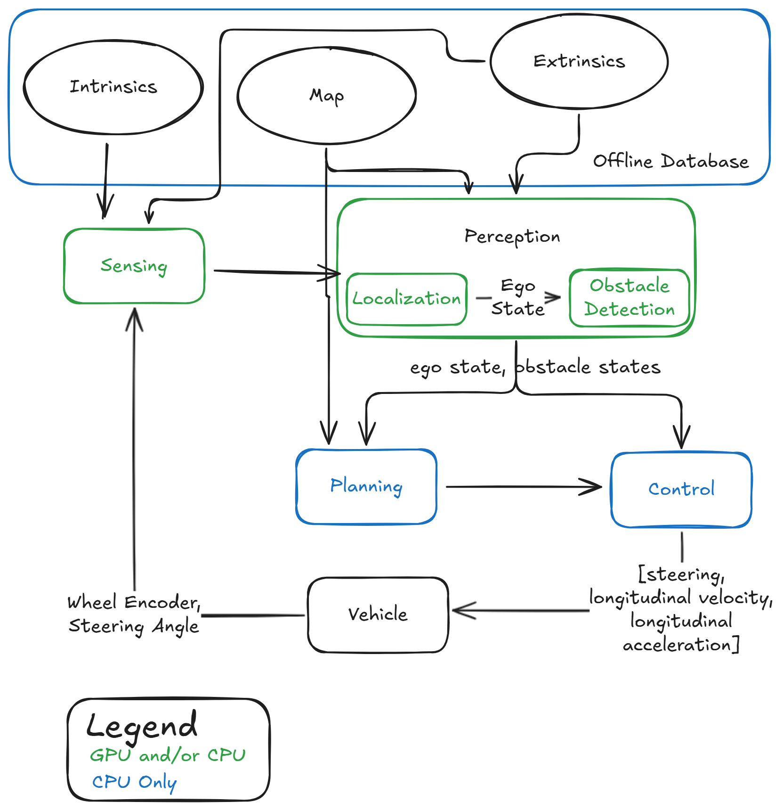

<!--
S00 Overview

Section file for the F1TENTH deck. Slides are separated by a line containing
only `---`. Every slide carries one cut tag; a slide with no tag is
reference-only and appears in `build.sh full` alone.

Conventions (plan §1) - the build enforces the first three:
  - a placeholder card's ID must be listed in ASSETS.md, and an asset marked
    DONE there must be embedded, not carded;
  - no slide body may name an agent file or a bug ID (speaker notes may);
  - every number on a slide needs a note of the form "src: FILE; measured DATE"
    in an HTML comment on that slide;
  - the title is the claim the slide makes, not the topic;
  - rates, latency, resolution and defaults/min/max go in tables, not prose.

Owner: B1 (f1tenth_launch)
Plan rows for this section are quoted above each slide, verbatim from §3.
-->

<!-- cut: lab sponsor research -->
<!-- _class: title -->
<!-- plan §3 row 0.1 | owner: B1 (f1tenth_launch) -->

## Title

> [!PLACEHOLDER PHOTO-CAR]
>
> photo not produced yet - see ASSETS.md for how to produce it.

<!--
TODO: write the slide. This comment is the plan, not the slide.

plan content: Project name, lab, date, repos, one photo of the car
plan source:  photos

Title must state the claim this slide makes; rewrite it if the plan's
wording is a topic. Put rates/limits/defaults in a table.
Add one note per number:  src: FILE; measured YYYY-MM-DD
-->

---

<!-- cut: lab sponsor research -->
<!-- plan §3 row 0.2 | owner: B1 (f1tenth_launch) -->

## What the car does today

<!--
TODO: write the slide. This comment is the plan, not the slide.

plan content: Status board: teleop, 2D/3D mapping, AMCL+EKF localization, Nav2 has driven the car, MPC live drives, perception nodes exist but are not integrated in bringup. Each row: status, date last verified
plan source:  CLAUDE.md, live_runs docs

Title must state the claim this slide makes; rewrite it if the plan's
wording is a topic. Put rates/limits/defaults in a table.
Add one note per number:  src: FILE; measured YYYY-MM-DD
-->

---

<!-- cut: lab sponsor research -->
<!-- plan §3 row 0.3 | owner: B1 (f1tenth_launch) -->

## The system is six layers

<!--
REFERENCE FIGURE, NOT FINAL. This PNG is an Excalidraw export the planning chat
worked from; it is queued for replacement by an accurate SVG / mermaid / TikZ
drawing (see Open items in ASSETS.md). Two things it needs on the slide either
way: its rate annotations are DESIGN TARGETS, not measurements, so pair it with
the measured table and say so in one line; and check the crop/attribution notes
for this figure in the register before shipping it.
-->

<!--
TODO: write the slide. This comment is the plan, not the slide.

plan content: Excalidraw system architecture (sensing, perception, localization, planning, control, vehicle, offline database) with GPU/CPU legend
plan source:  Obsidian `0_SystemArchitecture`

Title must state the claim this slide makes; rewrite it if the plan's
wording is a topic. Put rates/limits/defaults in a table.
Add one note per number:  src: FILE; measured YYYY-MM-DD
-->

---

<!-- cut: lab sponsor -->
<!-- plan §3 row 0.4 | owner: B1 (f1tenth_launch) -->

## Software stack

> [!PLACEHOLDER TABLE-REPOS]
>
> table not produced yet - see ASSETS.md for how to produce it.

<!--
TODO: write the slide. This comment is the plan, not the slide.

plan content: ROS 2 Humble on Jetson Orin Nano Super (JetPack 6.2, L4T r36.4.3), CycloneDDS, docker image `humble-devel-08302026`; table of the repos in `f1tenth.repos` with one line each
plan source:  f1tenth.repos, memory notes

Title must state the claim this slide makes; rewrite it if the plan's
wording is a topic. Put rates/limits/defaults in a table.
Add one note per number:  src: FILE; measured YYYY-MM-DD
-->

---

<!-- reference-only: no cut tag (plan §3 marks this R) -->
<!-- plan §3 row 0.5 | owner: B1 (f1tenth_launch) -->

## Launch tree and two-phase startup

> [!PLACEHOLDER FIG-LAUNCHTREE]
>
> diagram not produced yet - see ASSETS.md for how to produce it.

<!--
TODO: write the slide. This comment is the plan, not the slide.

plan content: `bringup.launch.py` tree; delays 6 s camera, 2 s LiDAR, 10 s localization, 15 s mapping/Nav2 and why (TF races, USB bandwidth)
plan source:  CLAUDE.md §Architecture

Title must state the claim this slide makes; rewrite it if the plan's
wording is a topic. Put rates/limits/defaults in a table.
Add one note per number:  src: FILE; measured YYYY-MM-DD
-->

