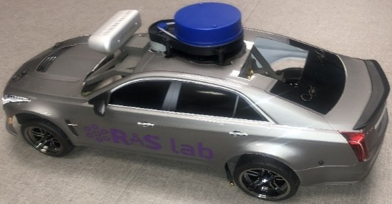

<!--
S00 Overview

Section file for the F1TENTH deck. Slides are separated by a line containing
only `---`. Every slide carries one cut tag; a slide with no tag is
reference-only and appears in `build.sh full` alone.

Conventions (plan §1) - the build enforces the first three:
  - a placeholder card's ID must be listed in ASSETS.md, and an asset marked
    DONE there must be embedded, not carded;
  - no slide body may name an agent file or a bug ID (speaker notes may);
  - every number on a slide needs a note of the form "src: FILE; measured DATE"
    in an HTML comment on that slide;
  - the title is the claim the slide makes, not the topic;
  - rates, latency, resolution and defaults/min/max go in tables, not prose.

Owner: B1 (f1tenth_launch)
Plan rows for this section are quoted above each slide, verbatim from §3.
-->

<!-- cut: lab sponsor research -->
<!-- _class: title -->
<!-- plan §3 row 0.1 | owner: B1 (f1tenth_launch) -->

# F1TENTH autonomous vehicle platform

## RAS Lab, Florida State University — September 2026

**ROS 2 Humble · Jetson Orin Nano Super · 21 source repositories**
`f1tenth_launch` (this deck) · `f1tenth_system` · `trajectory_following_ros2` · `particle_filter` · `autodriver_*`

<!-- src: f1tenth.repos (21 entries), photo docs/attachments/F1tenthDocumentation_v1_1_Release/media/image1.jpeg; deck date 2026-09-02 -->
<!-- Speaker: this deck covers what has been measured on this car, with the date of
     every measurement. Where nothing has been measured the slide says TBD. -->

---

<!-- cut: lab sponsor research -->
<!-- _class: dense -->
<!-- plan §3 row 0.2 | owner: B1 (f1tenth_launch) -->

## Teleop, mapping, localization and Nav2 run on the car; perception does not yet

| Capability | Status | Last verified on hardware |
|---|---|---|
| Teleoperation, joystick to VESC | works — deadman held, 1.0 m/s sustained 12.6 s, stops on release | 2026-08-05 |
| 2D mapping, SLAM Toolbox and RTABMap grid | works — current grid is the map every other subsystem is keyed to | 2026-08-05 |
| 3D mapping, RTABMap RGB-D cloud | works — cloud re-exported into the grid frame, checked in RViz | 2026-08-30 |
| Local fusion, 6-source EKF at 30 Hz | works — parked yaw drift +0.04 °/min, was −13.94 | 2026-08-26 |
| Global localization, AMCL + map EKF | works — 6 of 6 cold launches seeded within 8 mm / 0.20° | 2026-08-27 |
| Nav2, goal to motion | drives, never formally arrives — 5.78 m path, stops 0.379 m short of a 0.25 m tolerance | 2026-08-27 |
| MPC path following (separate repo) | drives the car — publishes `drive` directly, bypassing Nav2's controller | 2026-08-27 |
| Obstacle avoidance under Nav2 | untested — no obstacle has ever been placed in front of it | — |
| Perception (laser / cloud / image detectors) | not in bringup — packages build and run standalone only | — |
| Actuator calibration | steering settled, speed is not — see the calibration section | 2026-09-01 |

<!-- src: CLAUDE.md status entries and scripts/live_runs/*.md; dates as shown in the right-hand column -->
<!-- ARBITRATION: the MPC row is the control chat's to date and word; it is here
     because plan §3 row 0.2 asks for it on the status board. -->

---

<!-- cut: lab sponsor research -->
<!-- _class: cols -->
<!-- plan §3 row 0.3 | owner: B1 (f1tenth_launch) -->

## The system is six layers, and the loop closes through the vehicle

**Green = may run on the GPU. Blue = CPU only.**

- **Offline database** — intrinsics, extrinsics and the map are built once and loaded, not estimated online
- **Sensing** — stereo, LiDAR, two IMUs, wheel and steering feedback
- **Perception** — localization is inside it: the ego state feeds obstacle detection
- **Planning → Control → Vehicle** — and the vehicle's own encoder and steering angle return to sensing

*The rates on this drawing are design targets. Every measured rate in this deck comes from a bag.*

<!-- src: figure exported from the Obsidian `0_SystemArchitecture` note, received 2026-09-02; reference export, an accurate redraw is queued -->

---

<!-- cut: lab sponsor -->
<!-- _class: dense -->
<!-- plan §3 row 0.4 | owner: B1 (f1tenth_launch) -->

## Every node is upstream or a lab fork; this package is launch and config only

**ROS 2 Humble** on JetPack 6.2 (L4T r36.4.3), CUDA 12.6, `rmw_cyclonedds_cpp`, container image `humble-devel-08302026`.

| Repository | What it provides | Branch |
|---|---|---|
| `f1tenth_launch` | this package — launch files and YAML, no custom nodes | `humble-dev` |
| `f1tenth_system` | VESC driver, `ackermann_to_vesc`, `vesc_to_odom`, `joy_teleop` fork | `humble-devel` |
| `autodriver_command_gate` | the heartbeat-gated safety relay to the VESC | `master` |
| `trajectory_following_ros2` | the `Twist` converters and the MPC | `master` |
| `realsense-ros`, `ydlidar_ros2_driver`, `laser_filters` | sensor drivers and the scan filter | fork, `humble`, `ros2` |
| `rf2o_laser_odometry` | LiDAR odometry, with the zero-velocity gate | `ros2` |
| `particle_filter` | GPU Monte-Carlo localization | `foxy-devel-robot-fixes` |
| `autodriver_*`, `ros_multi_object_tracker` | perception — builds and runs, not in bringup | various |

<!-- src: f1tenth.repos (21 entries, 10 rows shown); platform from the memory notes on gosling1, image committed 2026-08-30 -->
<!-- The remaining repos are ros_images_to_files, autodriver_fake_obstacle_publisher and autodriver_icp_localizer. -->

---

<!-- reference-only: no cut tag (plan §3 marks this R) -->
<!-- _class: dense -->
<!-- plan §3 row 0.5 | owner: B1 (f1tenth_launch) -->

## Startup is staged on purpose: sensors first, then TF, then anything that consumes TF

| Stage | Delay | Why it waits |
|---|---|---|
| LiDAR | 2 s | USB bandwidth — the camera and the X4 contend on the same controller |
| Camera + stereo/depth pipeline | 6 s | as above; the RealSense enumerates slowly under load |
| Localization | 10 s | the static TF tree must be published before an EKF starts consuming it |
| Mapping and Nav2 | 15 s | both need sensors *and* a live `odom → base_link` before they configure |

<!-- src: launch/sensors/sensors.launch.py (camera_launch_delay 6.0, laserscan_launch_delay 2.0), launch/bringup.launch.py TimerAction periods; read 2026-09-02 -->
