<!--
S10 Hardware

Section file for the F1TENTH deck. Slides are separated by a line containing
only `---`. Every slide carries one cut tag; a slide with no tag is
reference-only and appears in `build.sh full` alone.

Conventions (plan §1) - the build enforces the first three:
  - a placeholder card's ID must be listed in ASSETS.md, and an asset marked
    DONE there must be embedded, not carded;
  - no slide body may name an agent file or a bug ID (speaker notes may);
  - every number on a slide needs a note of the form "src: FILE; measured DATE"
    in an HTML comment on that slide;
  - the title is the claim the slide makes, not the topic;
  - rates, latency, resolution and defaults/min/max go in tables, not prose.

Owner: B1 (f1tenth_launch)
Plan rows for this section are quoted above each slide, verbatim from §3.
-->

<!-- cut: lab sponsor research -->
<!-- _class: dense -->
<!-- plan §3 row 1.1 | owner: B1 (f1tenth_launch) -->

## One 1/10-scale chassis carries a GPU computer, a smart ESC and three sensors

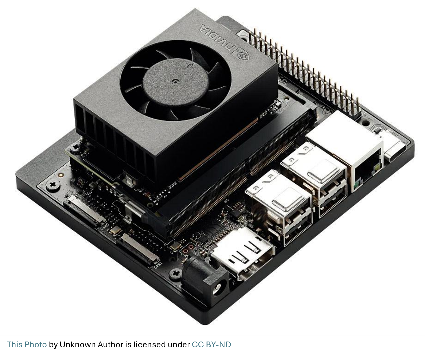 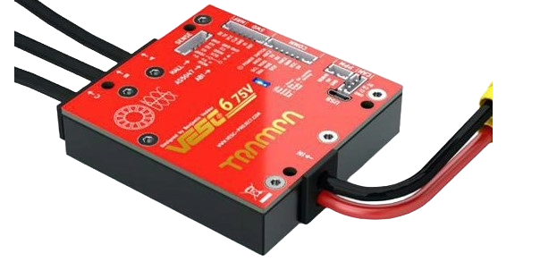 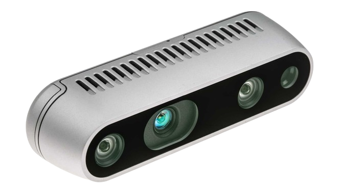 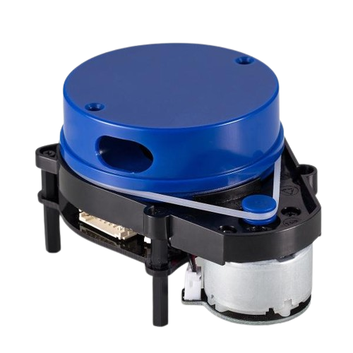 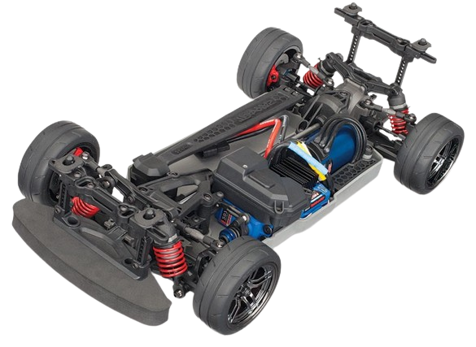 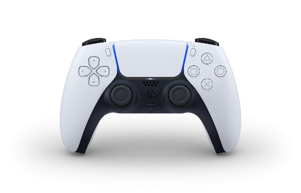

| Component | Specification that matters downstream |
|---|---|
| Jetson Orin Nano Super | 6-core Cortex-A78AE, 1024 CUDA cores + 32 tensor cores, 8 GB LPDDR5, 1 TB NVMe, 15 W |
| VESC 6 MkVI | brushless ESC, 3S at 11.1 V nominal, 80 A continuous (120 A peak), onboard IMU, actuator feedback |
| Intel RealSense D435i | RGB and two IR streams at 848×480×30, depth from the IR pair, IMU at 200 Hz |
| YDLidar X4 | single-plane scan, 0.12–10 m, 12 Hz requested and ~8 Hz achieved on this compute |
| Traxxas 4-Tec 2.0 VXL | wheelbase 0.256 m, wheel radius 0.033 m, overall drive ratio 6.87, one steering servo |
| Sony DualSense | Bluetooth pad — the deadman, the estop, and the gate's heartbeat all come from it |

<!-- src: docs/F1tenthDocumentation_v1_1_Release.md §Hardware Components (v1); LiDAR rate from config/sensors/ydlidar_X4.yaml comment, observed on gosling1; camera profiles from config/sensors/realsense_config.yaml; read 2026-09-02 -->
<!-- Photos are the 2024 release-doc component shots. They are current hardware, so no 2024 label. -->

---

<!-- cut: lab sponsor research -->
<!-- _class: cols -->
<!-- plan §3 row 1.2 | owner: B1 (f1tenth_launch) -->

## `base_link` is the rear axle, and every sensor offset is a measured constant


Nine fixed transforms, published by one launch file. The camera's own frames come from the URDF, with **calibrated** rather than nominal extrinsics.

**The wheelbase 0.256 m appears three times** — here, in the kinematic wheel odometry, and in the planner's turning radius. They have to agree, and for a while they did not.

<!-- src: launch/vehicle/static_transformations.launch.py (nine static_transform_publisher nodes) and urdf/f1tenth.urdf.xacro; read 2026-09-02. Wheelbase aligned 0.25 -> 0.256 on 2026-08-07. -->
<!-- This is the offline reconstruction. A `ros2 run tf2_tools view_frames` capture on a
     running stack replaces it if the robot session produces one. -->

---

<!-- cut: lab sponsor -->
<!-- _class: dense -->
<!-- plan §3 row 1.3 | owner: B1 (f1tenth_launch) -->

## Two batteries, two grounds, and only one of them is visible to ROS

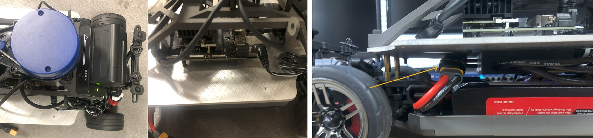

| | Jetson + sensors | VESC drive pack |
|---|---|---|
| Cell chemistry | NP-F750 Li-ion, 5600 mAh | Venom 3S LiPo, 5000 mAh |
| Voltage min / nominal / max | 7.2 / 7.7 / 8.4 V | 9.2 / 11.1 / 12.6 V |
| Connector | NP-F adapter, 7.4 or 12 V at 2 A, into the DC barrel jack | XT90 |
| Reported in ROS? | **no topic at all** | yes — `voltage_input` in `sensors/core` |
| Failure looks like | the whole computer disappears mid-run | the ESC cuts out, everything else survives |

A **USB isolator** between the ESC and the computer breaks the ground loop the two chemistries would otherwise form. Store the LiPo at 11.3 V.

> [!PLACEHOLDER FIG-ELEC]
>
> Power and data topology: two supplies, the isolator, which USB device is on which bus. Not drawn yet.

<!-- src: docs/F1tenthDocumentation_v1_1_Release.md §Hardware Components, §Wiring (Power) Connection Sequence, §Battery Management; read 2026-09-02. "No topic" confirmed against the vesc driver's published fields. -->

---

<!-- reference-only: no cut tag (plan §3 marks this R) -->
<!-- plan §3 row 1.4 | owner: B1 (f1tenth_launch) -->

## Assembly is seven steps from bare chassis to sensor kit

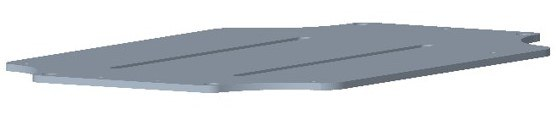 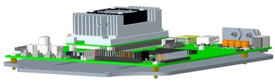 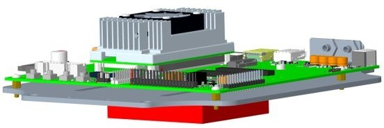 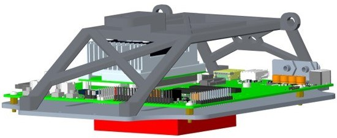

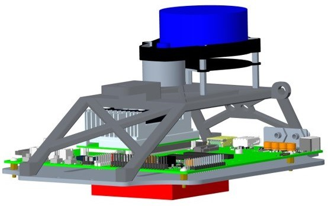 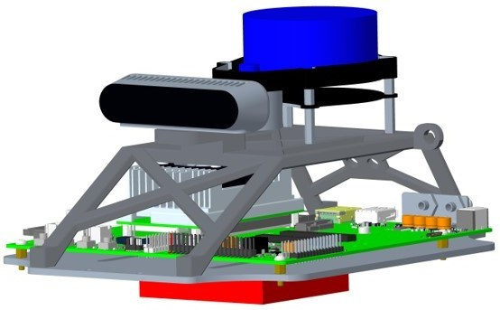 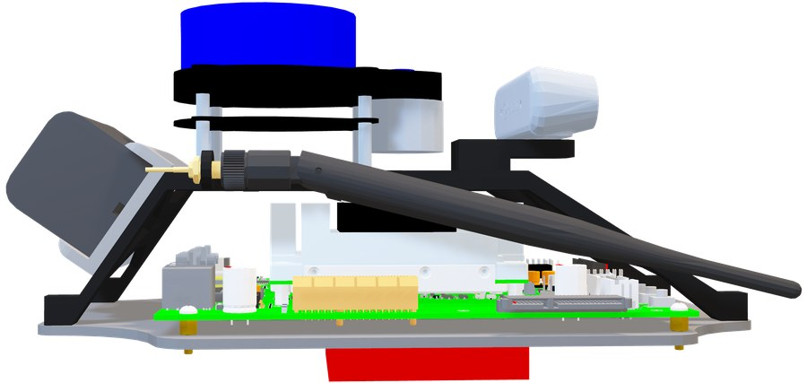

Base plate → computer → VESC → rollcage (Nylon-12) → LiDAR → camera → NP-F battery. The body shell is a 2019 Cadillac CTS-V plastic shell and is optional for driving.

<!-- src: docs/figures/teleop/assembly/*, docs/F1tenthDocumentation_v1_1_Release.md §Hardware Connection Setup; read 2026-09-02 -->

---

<!-- reference-only: no cut tag (plan §3 marks this R) -->
<!-- _class: dense -->
<!-- plan §3 row 1.5 | owner: B1 (f1tenth_launch) -->

## Off-board RViz is affordable over the network; an off-board image stream is not

| Subscription set | Cost over the wire |
|---|---|
| RViz-like set: scan, odom, TF, map, `map/pointcloud`, particles, `amcl_pose` | **~99 kB/s** |
| `camera/color/image_raw` alone | **31.3 MB/s** — about 300× the whole RViz set |
| Lab background traffic, with our stack stopped | ~385 kB/s (subtract it before reading any figure above) |

| Live-link check, full bringup running | Result |
|---|---|
| Nodes visible from the remote workstation | 40 |
| `odometry/local` across the wire | 30.00 Hz |
| `lidar/scan_filtered` across the wire | 8.72 Hz |
| Zero-speed `drive` commands delivered remotely to the mux | 10 of 10 |
| CycloneDDS write errors in 40 min of launch log | 0 |

**The one configuration rule**: loopback must rank *below* the physical NIC in the CycloneDDS interface list. With loopback ranked above it, the participant advertises `127.0.0.1` as its preferred locator, remote discovery silently finds nothing, and every announcement to a remote peer costs one unroutable-host error.

<!-- src: CLAUDE.md §CycloneDDS interface priority; measured gosling1 <-> velox1 2026-09-01 -->

---

<!-- reference-only: no cut tag (plan §3 marks this R) -->
<!-- _class: dense -->
<!-- plan §3 row 1.6 | owner: B1 (f1tenth_launch) -->

## The button numbering is SDL's, not the legacy joydev numbering everyone remembers

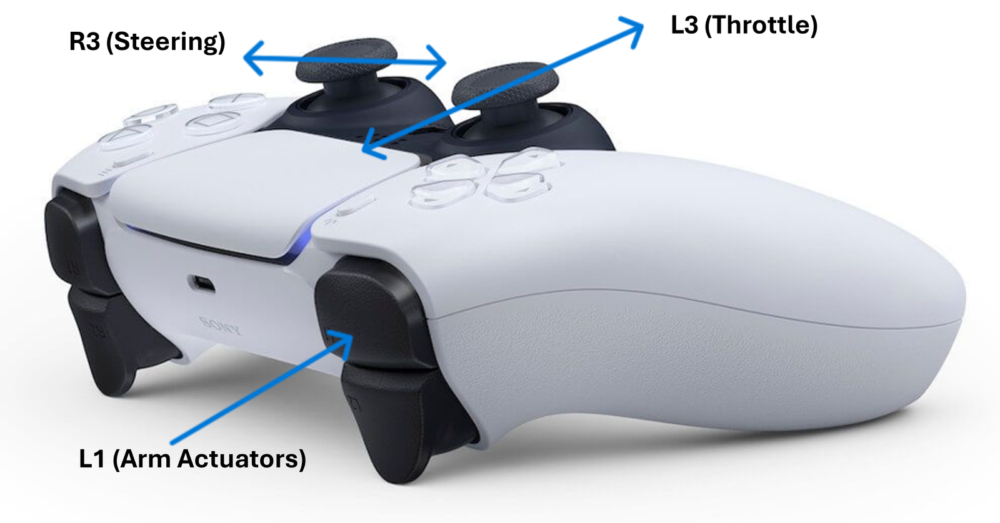

| Button | SDL index (what the Humble `joy` node reports) | Role here |
|---|---|---|
| L1 | 9 | manual deadman |
| R1 | 10 | autonomous deadman / handover |
| Share | 4 | manual deadman (second) |
| PS | 5 | **never** in a deadman list — its long-press is the power-off gesture |

Pairing needs the **BR/EDR** transport: a plain Bluetooth scan shows the pad only as a BLE device and pairing then fails. Hold Create + PS to enter pairing mode; it times out after 60 s.

<!-- src: config/vehicle/joy_teleop.yaml, launch/vehicle/joystick.launch.py defaults; SDL mapping and the PS-button hazard measured on gosling1 2026-08-05; pairing procedure from the memory note on BR/EDR -->
