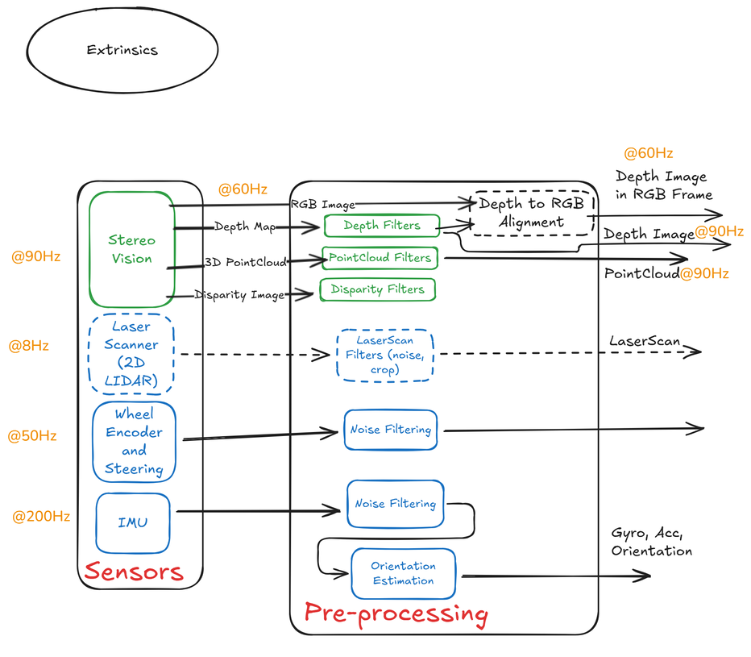
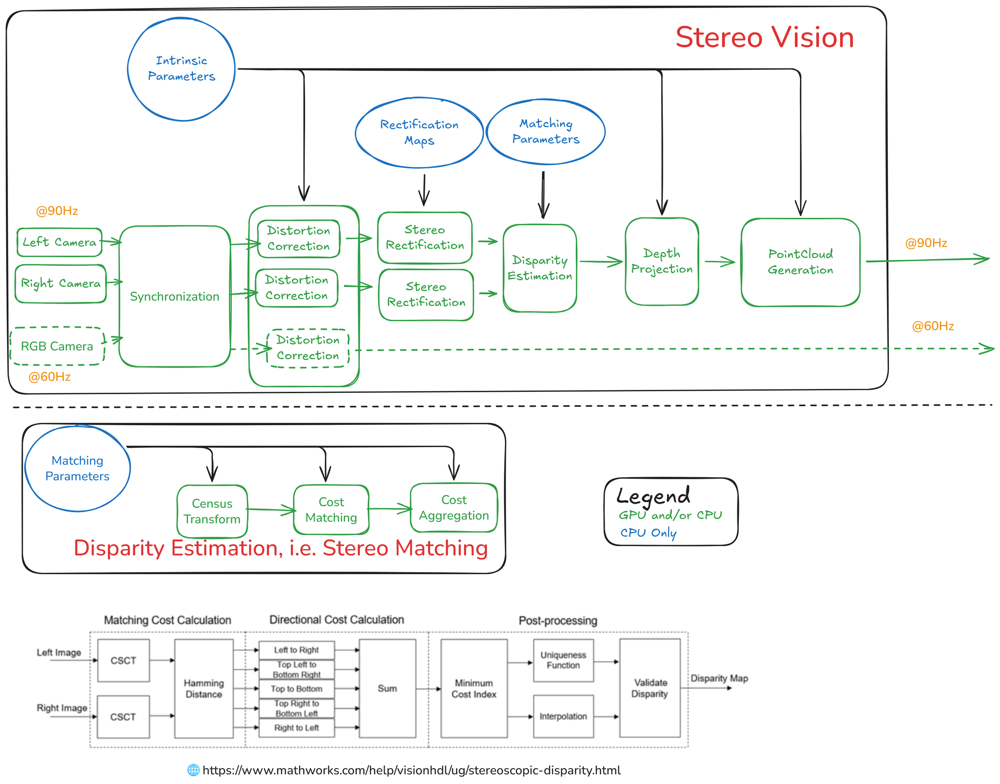
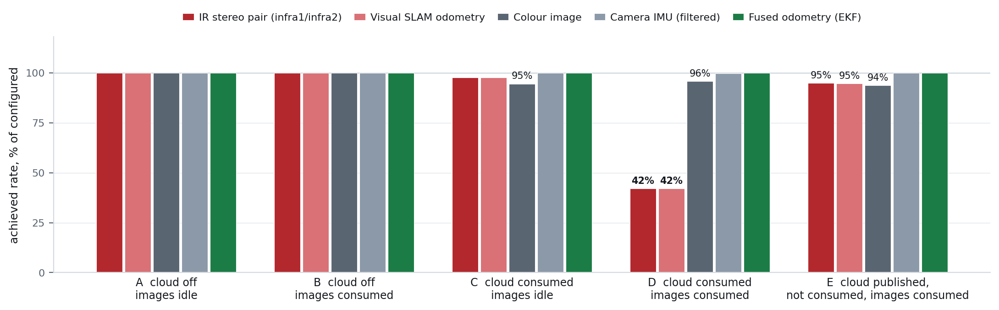

<!--
S20 Sensing

Section file for the F1TENTH deck. Slides are separated by a line containing
only `---`. Every slide carries one cut tag; a slide with no tag is
reference-only and appears in `build.sh full` alone.

Conventions (plan §1) - the build enforces the first three:
  - a placeholder card's ID must be listed in ASSETS.md, and an asset marked
    DONE there must be embedded, not carded;
  - no slide body may name an agent file or a bug ID (speaker notes may);
  - every number on a slide needs a note of the form "src: FILE; measured DATE"
    in an HTML comment on that slide;
  - the title is the claim the slide makes, not the topic;
  - rates, latency, resolution and defaults/min/max go in tables, not prose.

Owner: B1 (f1tenth_launch)
Plan rows for this section are quoted above each slide, verbatim from §3.
-->

<!-- cut: lab sponsor research -->
<!-- _class: cols -->
<!-- plan §3 row 2.1 | owner: B1 (f1tenth_launch) -->

## Nothing reaches an estimator raw: every sensor passes a pre-processing stage first

Four sensor groups, each with its own filter chain:

- **Stereo** → depth, disparity and colour cloud, aligned to the RGB frame
- **2D LiDAR** → a noise/crop filter before anything consumes the scan
- **Wheel encoder and steering** → the only sensor measuring the *actuator*
- **IMU** → noise filtering, then orientation estimation

*The rates printed here are design targets. What the hardware delivers is in the next slides, and it is lower.*

<!-- src: figure exported from the Obsidian `1_Sensing` note, received 2026-09-02, cropped above its notes block; reference export, redraw queued. Configured/measured rates: config/sensors/*.yaml and the bag statistics slide. -->

---

<!-- cut: lab research -->
<!-- _class: dense -->
<!-- plan §3 row 2.2 | owner: B1 (f1tenth_launch) -->

## The camera runs at 848×480×30 with the IR emitter off, and no post-processing filter is enabled

| Topic | Format | Configured | Measured | On by default |
|---|---|---|---|---|
| `camera/color/image_raw` | 848×480, RGB8 | 30 fps | **29.97** | yes |
| `camera/infra1/image_rect_raw`, `…infra2…` | 848×480, Y8 | 30 fps | **29.97** | yes |
| `camera/depth/image_rect_raw` | 848×480, Z16 | 30 fps | **29.97** | yes |
| `camera/aligned_depth_to_color/image_raw` | 848×480 | 30 fps | **29.97** | yes |
| `camera/depth/color/points` | coloured cloud, from the RealSense SDK | 30 fps | **not published** | **no** — `publish_realsense_pointcloud` defaults `False` |
| `camera/imu` → `camera/imu/filtered` | gyro + accel, interpolated | 200 Hz | **199.87 / 200.07** | yes |

- **IR emitter off** — on, it improves depth and prints a structured-light pattern across both IR images that makes them useless for visual odometry. This platform's odometry needs the IR pair, so the emitter loses.
- **Every post-processing filter is commented out** — decimation, spatial, temporal, disparity and hole-filling. Depth arrives full-resolution, unsmoothed, clipped at 6.0 m.
- 848×480×60 works standalone but falls to ~20 Hz under full teleop load.
- **Measured** is a 60 s live window on the car — sensing + localization up, Nav2 not running, car parked. Every stream holds 100 % of its configured rate. All six topics use `SENSOR_DATA` QoS.

<!-- src: config/sensors/realsense_config.yaml and launch/sensors/realsense_d435i.launch.py (qos default SENSOR_DATA, emitter_enabled 0, align_depth True, enable_pointcloud False); read 2026-09-02 -->
<!-- src: assets/data/rates_live_20260903_nocloud_baseline.json; measured 2026-09-03 (60 s, gosling1, stack up, parked, Nav2 off). Image rates metered via each stream's paired camera_info, 1:1 with the image in every bag carrying both, so that metering them does not perturb them. -->
<!-- CORRECTION to plan §3 row 2.2 and to this slide as first written: the cloud row said
     "on by default: yes - from depth_image_proc, not the RealSense SDK". Both halves are
     wrong. `camera/depth/color/points` is the RealSense driver's own cloud
     (publish_realsense_pointcloud -> enable_pointcloud -> pointcloud.enable), default
     'False' at bringup.launch.py:166; depth_image_proc's clouds go to different topics
     (points_from_depth_proc / points_from_aligned_depth_proc), and its own enabling flag
     depthimage_to_pointcloud also defaults 'False' at bringup.launch.py:163. Both child
     launch files default these True and are beaten by launch-config inheritance.
     Confirmed live 2026-09-03: the topic is not advertised under a default bringup. -->
<!-- CORRECTION to plan §3 row 2.2: the plan says "decimation 2". It is not enabled -
     the decimation_filter block is commented out in the YAML and nothing sets it in
     the launch files. Flagged in the hand-back. -->

---

<!-- reference-only: no cut tag (plan §3 marks this R) -->
<!-- plan §3 row 2.3 | owner: B1 (f1tenth_launch) -->

## Depth is computed on the camera, not on the Jetson

Rectification, cost matching and disparity all happen in the camera's ASIC; the computer receives depth and reprojects it. That is why the emitter is a *camera* setting with a *software* consequence — and why depth costs the host almost nothing.

<!-- src: figure exported from the Obsidian `1A_StereoVision` note, received 2026-09-02. Reference export; it embeds a third-party stereo-geometry figure that must be attributed or cropped before this deck is shown outside the lab. -->

---

<!-- cut: lab sponsor research -->
<!-- _class: dense -->
<!-- plan §3 row 2.4 | owner: B1 (f1tenth_launch) -->

## The LiDAR is configured to its spec, not its datasheet maximum — the difference was phantom obstacles

| Parameter | Value | Why not the obvious value |
|---|---|---|
| `range_max` | 10.0 m | 12.0 m admitted out-of-spec returns that appeared as phantom obstacles |
| `range_min` | 0.12 m | 0.10 m produced ghost returns clustered at the sensor origin |
| `frequency` | 12.0 requested, **~8 Hz observed** | USB and CPU contention on this compute; the driver does not report the shortfall |
| `invalid_range_is_inf` | `true` | out-of-range must be `inf`, not `0.0`, or the occupancy grid and the particle filter both mis-handle it |
| `intensity` | `false` | `true` causes checksum errors and a driver crash; `false` reports a constant 1008.0 status word |

`lidar/scan` → **speckle filter** (drop any return with no neighbour within 0.15 m) → `lidar/scan_filtered`, which is what every consumer subscribes to. The intensity filter in the same chain is permanently commented out: this sensor has no usable intensity to filter on.

> [!PLACEHOLDER VID-SENS-LIDAR]
>
> 10–20 s of `lidar/scan_filtered` in RViz while the car is pushed through the lab. The one sensor clip the talk shows.

<!-- src: config/sensors/ydlidar_X4.yaml (with its inline justifications), config/filters/laser_filter.yaml; read 2026-09-02 -->

---

<!-- cut: lab research -->
<!-- _class: dense -->
<!-- plan §3 row 2.5 | owner: B1 (f1tenth_launch) -->

## Two IMUs, and neither one is trusted for heading

| | VESC IMU | RealSense D435i IMU |
|---|---|---|
| Topic | `vehicle/sensors/imu/raw` | `camera/imu` → `camera/imu/filtered` |
| Rate | ~100 Hz | 200 Hz gyro and accel, linearly interpolated to one message |
| Magnetometer | none — the `mag` topic is a constant zero | none |
| Orientation from | the VESC's own on-board filter | `imu_filter_madgwick`, `constant_dt: 0.005` |
| Fused into the local EKF | roll and pitch only — **yaw disabled** | angular rate only — **acceleration disabled** |

**Why yaw is off on the VESC IMU**: with no magnetometer its on-board quaternion integrates a stable gyro bias and free-runs at about −14 °/min, while still advertising a tight yaw covariance — so the filter preferred it. Disabling it moved parked drift from **−13.94 °/min to +0.01…+0.17 °/min**.

**Why `constant_dt` is set**: the camera driver stamps its first two or three IMU samples seconds away from the rest. With `constant_dt: 0.0` the filter takes its integration step from those stamps, and one update swings attitude by **63–167°**. Pinning the step to 5 ms leaves a largest step of **0.187°** over a 217 s run — and the raw gyro shows the sensor never moved.

<!-- src: config/localization/ekf_odom.yaml, launch/filters/imu_filter.launch.py, launch/sensors/realsense_d435i.launch.py (imu_filter_constant_dt 0.005); yaw drift measured 2026-08-06, attitude step measured on run17 2026-08-26 -->

---

<!-- cut: lab sponsor research -->
<!-- plan §3 row 2.6 | owner: B1 (f1tenth_launch) -->

## Wheel odometry is three constants and a bicycle model — and it is silent while the car is parked

$$
v = \frac{\text{erpm}}{3750} \qquad
\delta = \frac{\text{servo} - 0.56}{-1.1448} \qquad
\omega = \frac{v \tan\delta}{0.256}
$$

- `vesc_to_odom` reads the ERPM and servo position the VESC reports back, not the values that were commanded — so it measures the actuator, not the intent.
- Every one of those three constants is calibration, and each is covered later: the steering pair is measured on this car, the speed gain is inherited and only corroborated.
- **It returns early until the first servo command arrives.** Parked with nothing driving, `vehicle/vesc_odom` publishes nothing at all — so the one source that could assert "the car is stopped" is absent exactly when a diverging filter would need it.

<!-- src: config/vehicle/vesc.yaml (speed_to_erpm_gain 3750, steering_angle_to_servo_gain -1.1448, offset 0.56), urdf/launch wheelbase 0.256 m; vesc_to_odom early-return confirmed in the f1tenth_system working copy 2026-08-25 -->

---

<!-- cut: lab sponsor research -->
<!-- _class: dense -->
<!-- plan §3 row 2.7 | owner: B1 (f1tenth_launch) -->

## It is not a recording bug: a consumer pulling the cloud *and* the images starves visual odometry

**Five 60 s conditions, parked, plain subscriber — no recorder, no disk write.** Only the fourth collapses: consuming the images alone costs nothing (B), publishing the cloud unconsumed costs a few percent (E), **both together drop the IR pair and visual SLAM to 42 %** while colour holds 96 % and the camera IMU 100 %. The same two streams — and only those — stopped in the 2026-09-01 drive recording (26 GiB / 214 s, against a `sysid` set's 47 MB / 105 s): **107 visual-SLAM messages against the fused EKF's 6415**, no crash, no log line.

**The rule is wider than "don't record pixels you don't need"** — any external consumer at that volume will do it. **Verify a stream by message count, not by a topic rate:** fusion holds 30 Hz on its other sources and looks healthy while one input is gone.

<!-- src: assets/data/rates_live_20260903_{nocloud_baseline,nocloud_stress,cloud_baseline,cloud_stress,cloud_unsubscribed_stress}.json via scripts/analysis/plot_rates.py; measured on gosling1 2026-09-03, stack up, car parked, Nav2 not running. Bag figures from scripts/live_runs/topic_sets.sh and scripts/analysis/bag_stats.py; measured 2026-09-01. Condition E's JSON records skipped_topics, so the un-consumed cloud is documented, not inferred; that the driver was publishing it rests on that run's launch configuration, and E's 95 % against B's 100 % under identical image load is the corroborating evidence. No egress threshold is claimed: aggregate volume and per-message size are confounded, and the 2026-09-01 measurement was taken driving while these five were parked. -->
