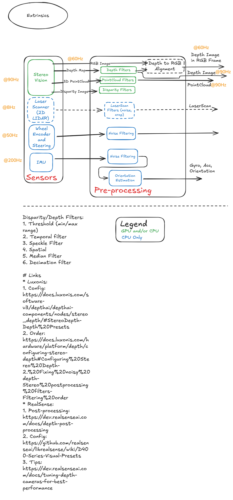

<!--
S20 Sensing

Section file for the F1TENTH deck. Slides are separated by a line containing
only `---`. Every slide carries one cut tag; a slide with no tag is
reference-only and appears in `build.sh full` alone.

Conventions (plan §1) - the build enforces the first three:
  - a placeholder card's ID must be listed in ASSETS.md, and an asset marked
    DONE there must be embedded, not carded;
  - no slide body may name an agent file or a bug ID (speaker notes may);
  - every number on a slide needs a note of the form "src: FILE; measured DATE"
    in an HTML comment on that slide;
  - the title is the claim the slide makes, not the topic;
  - rates, latency, resolution and defaults/min/max go in tables, not prose.

Owner: B1 (f1tenth_launch)
Plan rows for this section are quoted above each slide, verbatim from §3.
-->

<!-- cut: lab sponsor research -->
<!-- plan §3 row 2.1 | owner: B1 (f1tenth_launch) -->

## Sensing pipeline

<!--
REFERENCE FIGURE, NOT FINAL. This PNG is an Excalidraw export the planning chat
worked from; it is queued for replacement by an accurate SVG / mermaid / TikZ
drawing (see Open items in ASSETS.md). Two things it needs on the slide either
way: its rate annotations are DESIGN TARGETS, not measurements, so pair it with
the measured table and say so in one line; and check the crop/attribution notes
for this figure in the register before shipping it.
-->

<!--
TODO: write the slide. This comment is the plan, not the slide.

plan content: Excalidraw sensing diagram: stereo, LiDAR, wheel/steer, IMU, preprocessing filters, rates
plan source:  Obsidian `1_Sensing`

Title must state the claim this slide makes; rewrite it if the plan's
wording is a topic. Put rates/limits/defaults in a table.
Add one note per number:  src: FILE; measured YYYY-MM-DD
-->

---

<!-- cut: lab research -->
<!-- plan §3 row 2.2 | owner: B1 (f1tenth_launch) -->

## Camera streams

> [!PLACEHOLDER TABLE-CAMERA]
>
> table not produced yet - see ASSETS.md for how to produce it.

> [!PLACEHOLDER CHART-RATES]
>
> chart not produced yet - see ASSETS.md for how to produce it.

<!--
TODO: write the slide. This comment is the plan, not the slide.

plan content: Table per topic: RGB, infra1/2, depth, aligned depth, colored pointcloud, IMU. Columns: resolution, configured fps, **measured** Hz, QoS, on/off by default. Emitter-off trade-off (VSLAM vs depth quality), decimation 2, `ordered_pc: false`
plan source:  `config/sensors/realsense_config.yaml`, `realsense_d435i.launch.py`, `bag_stats.py` output

Title must state the claim this slide makes; rewrite it if the plan's
wording is a topic. Put rates/limits/defaults in a table.
Add one note per number:  src: FILE; measured YYYY-MM-DD
-->

---

<!-- reference-only: no cut tag (plan §3 marks this R) -->
<!-- plan §3 row 2.3 | owner: B1 (f1tenth_launch) -->

## Stereo to depth to pointcloud

<!--
REFERENCE FIGURE, NOT FINAL. This PNG is an Excalidraw export the planning chat
worked from; it is queued for replacement by an accurate SVG / mermaid / TikZ
drawing (see Open items in ASSETS.md). Two things it needs on the slide either
way: its rate annotations are DESIGN TARGETS, not measurements, so pair it with
the measured table and say so in one line; and check the crop/attribution notes
for this figure in the register before shipping it.
-->

<!--
TODO: write the slide. This comment is the plan, not the slide.

plan content: Excalidraw stereo pipeline (rectification, census/cost, disparity, projection)
plan source:  Obsidian `1A_StereoVision`

Title must state the claim this slide makes; rewrite it if the plan's
wording is a topic. Put rates/limits/defaults in a table.
Add one note per number:  src: FILE; measured YYYY-MM-DD
-->

---

<!-- cut: lab sponsor research -->
<!-- plan §3 row 2.4 | owner: B1 (f1tenth_launch) -->

## 2D LiDAR

> [!PLACEHOLDER VID-SENS-LIDAR]
>
> video not produced yet - see ASSETS.md for how to produce it.

<!--
TODO: write the slide. This comment is the plan, not the slide.

plan content: X4: 0.12-10 m (12 m spec caused phantoms), ~625 beams, 12 Hz configured / ~8 Hz observed, no intensity, `inf` for out-of-range; speckle filter `lidar/scan` to `lidar/scan_filtered`
plan source:  `config/sensors/ydlidar_X4.yaml`, `config/filters/laser_filter.yaml`, CLAUDE.md

Title must state the claim this slide makes; rewrite it if the plan's
wording is a topic. Put rates/limits/defaults in a table.
Add one note per number:  src: FILE; measured YYYY-MM-DD
-->

---

<!-- cut: lab research -->
<!-- plan §3 row 2.5 | owner: B1 (f1tenth_launch) -->

## Two IMUs, two treatments

> [!PLACEHOLDER TABLE-IMU]
>
> table not produced yet - see ASSETS.md for how to produce it.

<!--
TODO: write the slide. This comment is the plan, not the slide.

plan content: VESC IMU ~100 Hz, no magnetometer, onboard Madgwick, yaw not fused; D435i IMU 200 Hz through `imu_filter_madgwick` with `constant_dt` 0.005 and why (first samples have bogus stamps)
plan source:  CLAUDE.md §ekf_odom, `imu_filter.launch.py`

Title must state the claim this slide makes; rewrite it if the plan's
wording is a topic. Put rates/limits/defaults in a table.
Add one note per number:  src: FILE; measured YYYY-MM-DD
-->

---

<!-- cut: lab sponsor research -->
<!-- plan §3 row 2.6 | owner: B1 (f1tenth_launch) -->

## Wheel odometry

<!--
TODO: write the slide. This comment is the plan, not the slide.

plan content: `vesc_to_odom`: speed = erpm/3750, angle = (servo-0.56)/-1.1448, yaw rate = v tan(delta)/0.256; silent until first servo command
plan source:  `config/vehicle/vesc.yaml`, CLAUDE.md

Title must state the claim this slide makes; rewrite it if the plan's
wording is a topic. Put rates/limits/defaults in a table.
Add one note per number:  src: FILE; measured YYYY-MM-DD
-->

---

<!-- cut: lab sponsor research -->
<!-- plan §3 row 2.7 | owner: B1 (f1tenth_launch) -->

## Measured rates and bandwidth

> [!PLACEHOLDER CHART-RATES]
>
> chart not produced yet - see ASSETS.md for how to produce it.

<!--
TODO: write the slide. This comment is the plan, not the slide.

plan content: One chart of measured topic rates from a drive bag, with per-stream bandwidth (the image set is ~125 MB/s; the IMU-only `sysid` set is ~0.5 MB/s)
plan source:  `bag_stats.py`, CLAUDE.md §Debugging Caveats

Title must state the claim this slide makes; rewrite it if the plan's
wording is a topic. Put rates/limits/defaults in a table.
Add one note per number:  src: FILE; measured YYYY-MM-DD
-->

