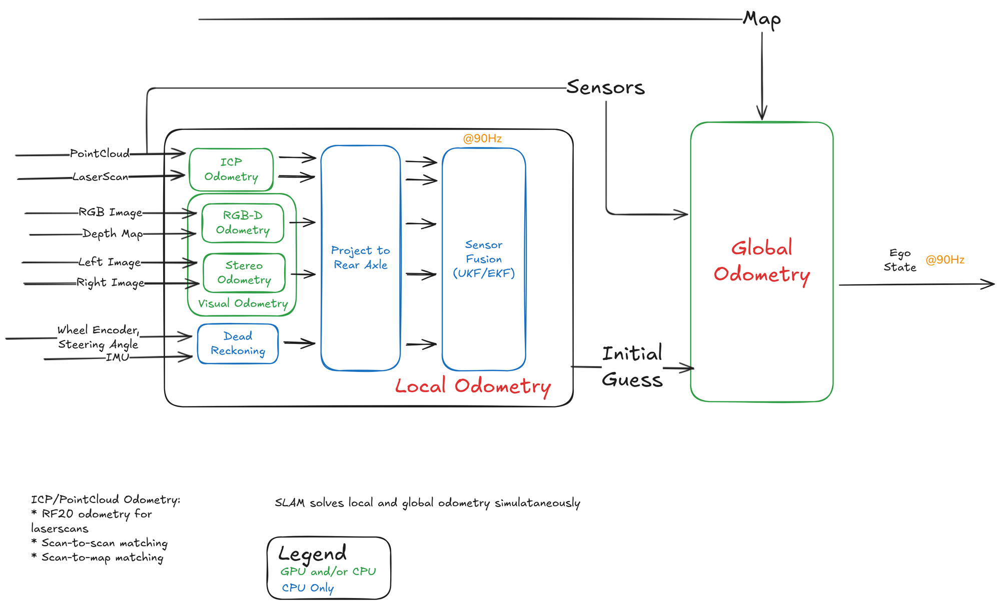

<!--
S30 Localization

Section file for the F1TENTH deck. Slides are separated by a line containing
only `---`. Every slide carries one cut tag; a slide with no tag is
reference-only and appears in `build.sh full` alone.

Conventions (plan §1) - the build enforces the first three:
  - a placeholder card's ID must be listed in ASSETS.md, and an asset marked
    DONE there must be embedded, not carded;
  - no slide body may name an agent file or a bug ID (speaker notes may);
  - every number on a slide needs a note of the form "src: FILE; measured DATE"
    in an HTML comment on that slide;
  - the title is the claim the slide makes, not the topic;
  - rates, latency, resolution and defaults/min/max go in tables, not prose.

Owner: B2 (f1tenth_launch)
Plan rows for this section are quoted above each slide, verbatim from §3.
-->

<!-- cut: lab sponsor research -->
<!-- plan §3 row 3.1 | owner: B2 (f1tenth_launch) -->

## Localization pipeline

<!--
REFERENCE FIGURE, NOT FINAL. This PNG is an Excalidraw export the planning chat
worked from; it is queued for replacement by an accurate SVG / mermaid / TikZ
drawing (see Open items in ASSETS.md). Two things it needs on the slide either
way: its rate annotations are DESIGN TARGETS, not measurements, so pair it with
the measured table and say so in one line; and check the crop/attribution notes
for this figure in the register before shipping it.
-->

<!--
TODO: write the slide. This comment is the plan, not the slide.

plan content: Excalidraw: dead reckoning, VO, ICP/scan odometry, fusion, local vs global
plan source:  Obsidian `2A_Localization`

Title must state the claim this slide makes; rewrite it if the plan's
wording is a topic. Put rates/limits/defaults in a table.
Add one note per number:  src: FILE; measured YYYY-MM-DD
-->

---

<!-- cut: lab sponsor research -->
<!-- plan §3 row 3.2 | owner: B2 (f1tenth_launch) -->

## Odometry sources

> [!PLACEHOLDER TABLE-ODOM]
>
> table not produced yet - see ASSETS.md for how to produce it.

<!--
TODO: write the slide. This comment is the plan, not the slide.

plan content: Table: `vehicle/vesc_odom`, `odom/rf2o` 10 Hz, Isaac cuVSLAM `visual_slam/tracking/odometry` 30 Hz GPU, RTABMap stereo/RGB-D/ICP (CPU alternatives, ICP off), kiss-icp optional. Columns: sensor, rate, frame, fused fields, on by default
plan source:  `ekf_odom.yaml`, `localization.launch.py`, CLAUDE.md

Title must state the claim this slide makes; rewrite it if the plan's
wording is a topic. Put rates/limits/defaults in a table.
Add one note per number:  src: FILE; measured YYYY-MM-DD
-->

---

<!-- cut: lab research -->
<!-- plan §3 row 3.3 | owner: B2 (f1tenth_launch) -->

## Local EKF design, and why each choice

> [!PLACEHOLDER FIG-EKF-INPUTS]
>
> diagram not produced yet - see ASSETS.md for how to produce it.

<!--
TODO: write the slide. This comment is the plan, not the slide.

plan content: 30 Hz; which fields from each source; differential/relative choices; rejection gates; init covariance 0.5; `odometry/local` is what Nav2 consumes. **Each non-default choice gets its one-line reason on the slide**: VESC yaw not fused (no magnetometer, onboard quaternion free-runs -14 deg/min while advertising tight covariance; parked drift -13.94 to +0.04 deg/min after), camera IMU acceleration not fused (attitude error at stream start leaves a ~1 g residual), rf2o gated at 5.0 Mahalanobis (timestamp spikes), `use_control` off (12 cm divergence on replay, no benefit)
plan source:  `config/localization/ekf_odom.yaml`, CLAUDE.md

Title must state the claim this slide makes; rewrite it if the plan's
wording is a topic. Put rates/limits/defaults in a table.
Add one note per number:  src: FILE; measured YYYY-MM-DD
-->

---

<!-- cut: lab sponsor research -->
<!-- plan §3 row 3.4 | owner: B2 (f1tenth_launch) -->

## Why fusion: the closure-error figure

> [!PLACEHOLDER CHART-CLOSURE]
>
> chart not produced yet - see ASSETS.md for how to produce it.

> [!PLACEHOLDER TABLE-TAPE]
>
> table not produced yet - see ASSETS.md for how to produce it.

<!--
TODO: write the slide. This comment is the plan, not the slide.

plan content: Bar chart of each estimator's error after a loop that returns to start; table: over 5.50 m tape, VSLAM +1.3 %, rf2o -6.1 %, EKF -3.1 %; yaw drift parked -13.94 to +0.04 deg/min after disabling VESC yaw
plan source:  `plot_localization.py` on `armA_loop2`, `SYSID_RESULTS.md`, CLAUDE.md

Title must state the claim this slide makes; rewrite it if the plan's
wording is a topic. Put rates/limits/defaults in a table.
Add one note per number:  src: FILE; measured YYYY-MM-DD
-->

---

<!-- cut: lab sponsor research -->
<!-- plan §3 row 3.5 | owner: B2 (f1tenth_launch) -->

## Global localization

> [!PLACEHOLDER VID-LOC-LOOP]
>
> video not produced yet - see ASSETS.md for how to produce it.

> [!PLACEHOLDER VID-PF-CONVERGE]
>
> video not produced yet - see ASSETS.md for how to produce it.

<!--
TODO: write the slide. This comment is the plan, not the slide.

plan content: map_server + AMCL (likelihood field, motion-gated) and `ekf_map` 10 Hz; `map->odom` owned by `ekf_map` via bringup; seed (0.445, -0.575, -84.5 deg) published to `initialpose` at +20 s; 6/6 cold launches within 8 mm / 0.2 deg
plan source:  `localizer_amcl.yaml`, `ekf_map.yaml`, CLAUDE.md

Title must state the claim this slide makes; rewrite it if the plan's
wording is a topic. Put rates/limits/defaults in a table.
Add one note per number:  src: FILE; measured YYYY-MM-DD
-->

---

<!-- reference-only: no cut tag (plan §3 marks this R) -->
<!-- plan §3 row 3.6 | owner: B2 (f1tenth_launch) -->

## Alternatives evaluated

<!--
TODO: write the slide. This comment is the plan, not the slide.

plan content: particle_filter (range_libc GPU, tuned params), slam_toolbox localizer, RTABMap localization mode; status of each
plan source:  `localizer_pf.yaml`, `BRIEF_PARTICLE_FILTER.md`

Title must state the claim this slide makes; rewrite it if the plan's
wording is a topic. Put rates/limits/defaults in a table.
Add one note per number:  src: FILE; measured YYYY-MM-DD
-->

---

<!-- reference-only: no cut tag (plan §3 marks this R) -->
<!-- plan §3 row 3.7 | owner: B2 (f1tenth_launch) -->

## Frames

> [!PLACEHOLDER FIG-TF-TREE]
>
> figure not produced yet - see ASSETS.md for how to produce it.

<!--
TODO: write the slide. This comment is the plan, not the slide.

plan content: map -> odom -> base_link, who publishes which TF and how `odom_tf_publisher` / `map_tf_publisher` select owners
plan source:  CLAUDE.md

Title must state the claim this slide makes; rewrite it if the plan's
wording is a topic. Put rates/limits/defaults in a table.
Add one note per number:  src: FILE; measured YYYY-MM-DD
-->

---

<!-- reference-only: no cut tag (plan §3 marks this R) -->
<!-- plan §3 row 3.8 | owner: B2 (f1tenth_launch) -->

## Seeding and start pose

> [!PLACEHOLDER FIG-MAP-2D]
>
> figure not produced yet - see ASSETS.md for how to produce it.

<!--
TODO: write the slide. This comment is the plan, not the slide.

plan content: Why the parking spot is not the map origin; how the heading was measured from raw scans
plan source:  CLAUDE.md, `DEMO_RUNBOOK_20260810.md` §5b

Title must state the claim this slide makes; rewrite it if the plan's
wording is a topic. Put rates/limits/defaults in a table.
Add one note per number:  src: FILE; measured YYYY-MM-DD
-->

