<!--
S30 Localization

Section file for the F1TENTH deck. Slides are separated by a line containing
only `---`. Every slide carries one cut tag; a slide with no tag is
reference-only and appears in `build.sh full` alone.

Conventions (plan §1) - the build enforces the first three:
  - a placeholder card's ID must be listed in ASSETS.md, and an asset marked
    DONE there must be embedded, not carded;
  - no slide body may name an agent file or a bug ID (speaker notes may);
  - every number on a slide needs a note of the form "src: FILE; measured DATE"
    in an HTML comment on that slide;
  - the title is the claim the slide makes, not the topic;
  - rates, latency, resolution and defaults/min/max go in tables, not prose.

Owner: B2 (f1tenth_launch)
Plan rows for this section are quoted above each slide, verbatim from §3.
-->

<!-- cut: lab sponsor research -->
<!-- _class: cols -->
<!-- plan §3 row 3.1 | owner: B2 (f1tenth_launch) -->

## Localization is two filters: one that never jumps, and one that is allowed to

- **`odom → base_link`** is continuous and drifts. Six sources at 30 Hz, no absolute reference, never a discontinuity. This is what a controller integrates against.
- **`map → odom`** is the correction. It jumps when a global localizer says so, and it is allowed to.
- Splitting them is what lets a scan matcher relocalize without teleporting the vehicle out from under the controller.

<!-- src: figure exported from the Obsidian `2A_Localization` note, received 2026-09-02; frame ownership from launch/localization/localization.launch.py and launch/bringup.launch.py, read 2026-09-02 -->

---

<!-- cut: lab sponsor research -->
<!-- _class: dense -->
<!-- plan §3 row 3.2 | owner: B2 (f1tenth_launch) -->

## Six odometry sources are wired; four carry data in the default configuration

| Source | Topic | Sensor | Rate | On by default |
|---|---|---|---|---|
| Wheel + steering | `vehicle/vesc_odom` | ERPM and servo feedback | ~50 Hz (20 ms VESC telemetry) | yes — but silent while parked |
| Visual SLAM (GPU) | `visual_slam/tracking/odometry` | IR stereo pair, Isaac cuVSLAM | 30 Hz | yes, when `use_gpu:=True` |
| LiDAR range-flow | `odom/rf2o` | `lidar/scan_filtered` | 10 Hz | yes |
| RTABMap ICP | `odom/rtabmap/icp` | LiDAR | — | **no** — wired into the filter, receives nothing |
| RTABMap stereo / RGB-D | `odom/rtabmap/stereo`, `…/rgbd` | camera, CPU | — | no — the CPU alternative to visual SLAM |
| kiss-icp | `/kiss/odom` | depth cloud | — | no |

**ICP is off for a measured reason**, not for tidiness: with it on, the local filter logged `Failed to meet update rate` and `odometry/local` ran at **12.78 Hz with 2.44 s gaps**. With it off: **29.70 Hz, worst gap 0.180 s**.

<!-- src: config/localization/ekf_odom.yaml (odom0..odom3), launch/localization/localization.launch.py defaults; ICP rate comparison measured on gosling1 2026-08-04 -->

---

<!-- cut: lab research -->
<!-- _class: dense cols -->
<!-- plan §3 row 3.3 | owner: B2 (f1tenth_launch) -->

## Every non-default choice in the local filter was forced by a measurement

| Choice | Reason it is not the default |
|---|---|
| VESC IMU **yaw disabled** | no magnetometer: its quaternion free-runs at −14 °/min while advertising a tight covariance. Parked drift went −13.94 → +0.04 °/min |
| Camera IMU **acceleration disabled** | attitude error at stream start leaves ~1 g of residual after gravity removal — 9.34 m/s² on a *parked* car — which integrates into velocity |
| VSLAM `differential:false, relative:true` | absolute poses fused as increments, so its map origin never becomes ours |
| rf2o `differential:true`, gate **3.0** | already-integrated deltas; the gate suppresses timestamp spikes |
| `use_control: false` | on a 63 s replay it added ~12 cm of divergence and no jitter benefit |
| `initial_estimate_covariance` **0.5** | VSLAM init messages with zero covariance drove P→0 and froze the filter at startup |
| `reset_on_time_jump: true` | makes bag replay work unattended |

<!-- src: config/localization/ekf_odom.yaml read 2026-09-02; yaw drift measured 2026-08-06, gravity residual 2026-08-25, use_control replay 2026-08 -->
<!-- CORRECTION: CLAUDE.md still records the rf2o gates as 5.0. The file says 3.0. Flagged in the hand-back. -->

---

<!-- cut: lab sponsor research -->
<!-- _class: dense -->
<!-- plan §3 row 3.4 | owner: B2 (f1tenth_launch) -->

## No single odometry source is trustworthy for scale — a tape measure settled it

| Reference | Reading over a 5.50 m straight run | Error |
|---|---|---|
| Tape measure (ground truth) | 5.500 m | — |
| Isaac visual SLAM | 5.570 m | **+1.3 %** |
| Fused `odometry/local` | 5.331 m | **−3.1 %** |
| rf2o LiDAR odometry | 5.163 m | **−6.1 %** |

Two references that each score R² ≈ 0.99 against the same bag disagree with each other by **6.3 %**. Fitting the speed constant against rf2o alone would have moved it from 3750 to ~3973 erpm per m/s — a change that is entirely rf2o's own scale error. And because rf2o is *fused into* the local filter, that error is part of why `odometry/local` also reads short.

> [!PLACEHOLDER CHART-CLOSURE]
>
> Per-estimator closure error over a loop that returns to its start: the same comparison as a bar chart, from a driven bag.

**The lesson generalizes**: an estimator that agrees with itself is not evidence. Calibration needs a reference that is not part of the system being calibrated.

<!-- src: scripts/live_runs/SYSID_RESULTS.md and the tape run on gosling1, measured 2026-09-01 -->

---

<!-- cut: lab sponsor research -->
<!-- _class: dense -->
<!-- plan §3 row 3.5 | owner: B2 (f1tenth_launch) -->

## Global localization now seeds itself, and it took six cold launches to believe it

| Component | Configuration |
|---|---|
| `map_server` + AMCL | likelihood-field laser model, motion-gated on `update_min_d` / `update_min_a` |
| Global EKF (`ekf_map`) | 10 Hz, `world_frame: map`, poses from AMCL and RTABMap, velocities from the VESC |
| `map → odom` publisher | the global EKF — through bringup, AMCL runs with `tf_broadcast: False` |
| Start-pose seed | (0.445 m, −0.575 m, −84.5°), published onto `initialpose` 5× at 1 Hz, 20 s after localization starts |

**Why the seed exists at all**: the map origin is not the parking spot. A car parked at its usual place *correctly* reports a large non-zero map pose, and AMCL is motion-gated, so parked it never runs a laser update and never republishes — re-seeding by hand looks like it does nothing.

**Acceptance was repeated cold launches with no manual seed: 6 of 6 passed**, `map → base_link` landing within **8 mm and 0.20°** of the seed every time.

> [!PLACEHOLDER VID-LOC-LOOP]
>
> Trailing `odometry/local` (blue) against `odometry/global` (green) over the map, one lap.

<!-- src: config/localization/localizer_amcl.yaml, config/localization/ekf_map.yaml, launch/localization/localization.launch.py (seed_initialpose, initialpose_seed_delay 20.0); six cold launches on gosling1 2026-08-27 -->

---

<!-- reference-only: no cut tag (plan §3 marks this R) -->
<!-- _class: dense -->
<!-- plan §3 row 3.6 | owner: B2 (f1tenth_launch) -->

## Four global localizers are wired; one is the default and the rest are one argument away

| Localizer | Status | Notes |
|---|---|---|
| **AMCL** | **default** | `nav2_amcl`, likelihood field, seeded at startup |
| MIT particle filter (`range_libc`) | wired, opt-in | GPU ray casting (`rmgpu`) chosen at launch when `use_gpu:=True`, `pcddt` on CPU. Tuned: 2000 particles, 40 Hz, `angle_step: 10` (~62 of the X4's ~625 beams), `sigma_hit: 2.0`, `motion_dispersion_theta: 0.05` |
| SLAM Toolbox localizer mode | wired, opt-in | reuses the pose graph rather than a grid |
| RTABMap localization mode | wired, opt-in | the same database that built the map |

The particle-filter package is optional: the launch catches `PackageNotFoundError` and continues without it. Selecting `map_tf_publisher:='pf'` only chooses **who broadcasts the transform** — it does not start the node; `launch_particle_filter:=True` does.

<!-- src: config/localization/localizer_pf.yaml, launch/localization/localization.launch.py; read 2026-09-02 -->

---

<!-- reference-only: no cut tag (plan §3 marks this R) -->
<!-- _class: dense -->
<!-- plan §3 row 3.7 | owner: B2 (f1tenth_launch) -->

## One launch argument picks each transform's owner, and the YAML never decides

| Transform | Argument | Default | Other owners it can take |
|---|---|---|---|
| `odom → base_link` | `odom_tf_publisher` | `ekf` | `vslam`, `stereo`, `rf2o`, `icp`, `rgbd`, `pointcloud`, `rtabmap` |
| `map → odom` | `map_tf_publisher` | `ekf` via bringup, `amcl` standalone | `amcl`, `slam`, `rtabmap`, `vslam`, `pf` |

The argument is applied **after** the parameter file in each node's parameter list, so it overrides whatever the YAML says. The YAML values are all kept `false` precisely so no file ever implies ownership on its own.

<!-- src: launch/localization/localization.launch.py (tf_broadcast set from map_tf_publisher), launch/bringup.launch.py map_tf_publisher default 'ekf'; verified live on gosling1 2026-08-10 -->

---

<!-- reference-only: no cut tag (plan §3 marks this R) -->
<!-- _class: cols -->
<!-- plan §3 row 3.8 | owner: B2 (f1tenth_launch) -->

## The start heading was measured from raw scans, because every stored value disagreed

Three headings were in circulation for one parking spot: **−79.8°** (a mapping run's start pose), **−92.1°** (a waypoint file) and **−84.5°** (a direct scan measurement). The scan measurement won: five samples over two cold launches agreed to **1.03°**, with a single unambiguous peak — which also retires the standing "a rectangular room looks symmetric to a planar LiDAR" explanation.

The **−79.8°** value was later explained rather than merely rejected: it is the first keyframe of a mapping run whose loop was never closed. First and last poses of that run sit **9.65° apart** for a car that started and ended in the same spot — and **−84.5° is 0.18° from their midpoint**.

<!-- src: config/localization/localizer_amcl.yaml initial_pose (0.445, -0.575, -1.4748 rad); scan measurement 2026-08-11, graph analysis 2026-09-01 -->
