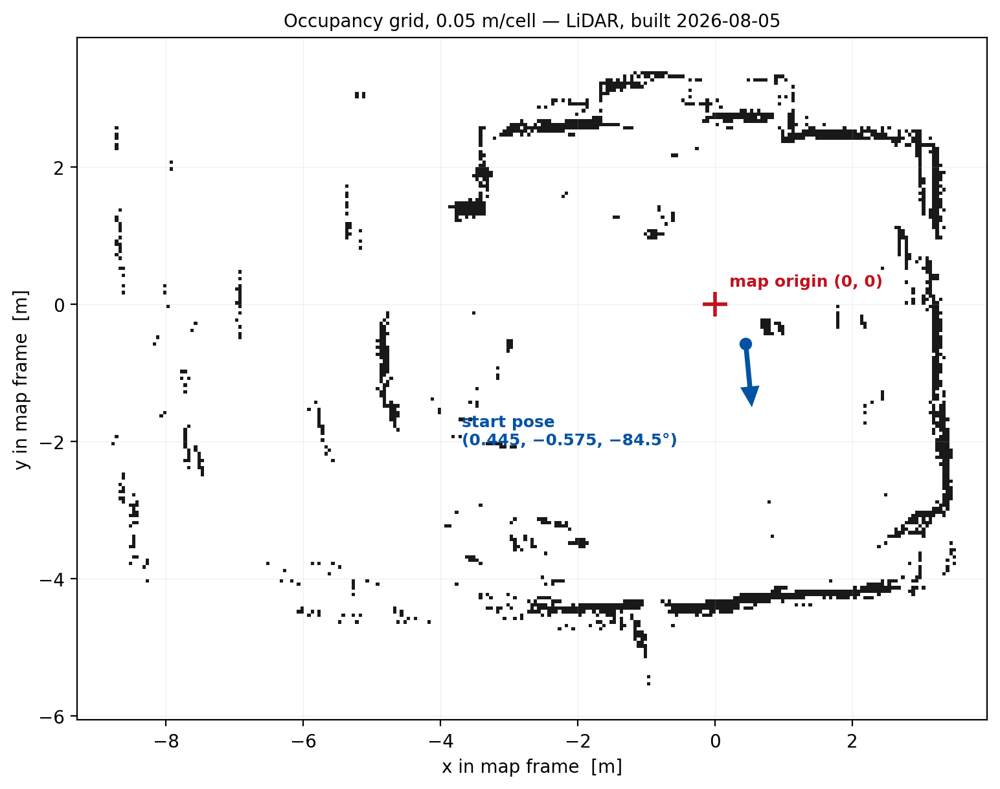
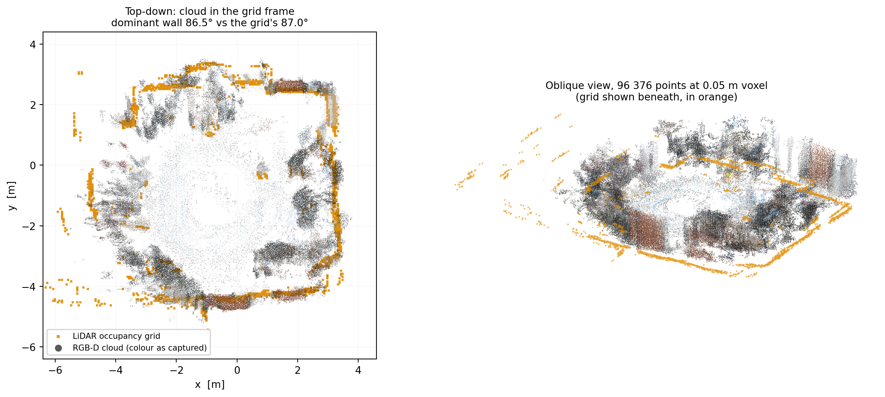

<!--
S40 Mapping

Section file for the F1TENTH deck. Slides are separated by a line containing
only `---`. Every slide carries one cut tag; a slide with no tag is
reference-only and appears in `build.sh full` alone.

Conventions (plan §1) - the build enforces the first three:
  - a placeholder card's ID must be listed in ASSETS.md, and an asset marked
    DONE there must be embedded, not carded;
  - no slide body may name an agent file or a bug ID (speaker notes may);
  - every number on a slide needs a note of the form "src: FILE; measured DATE"
    in an HTML comment on that slide;
  - the title is the claim the slide makes, not the topic;
  - rates, latency, resolution and defaults/min/max go in tables, not prose.

Owner: B2 (f1tenth_launch)
Plan rows for this section are quoted above each slide, verbatim from §3.
-->

<!-- cut: lab sponsor research -->
<!-- _class: cols -->
<!-- plan §3 row 4.1 | owner: B2 (f1tenth_launch) -->

## The 2D grid is built from the LiDAR alone, at 0.05 m, by either of two mappers

| | SLAM Toolbox | RTABMap grid |
|---|---|---|
| Resolution | 0.05 m | 0.05 m |
| Max range | 10.0 m | 15.0 m |
| Input | `lidar/scan_filtered` | `lidar/scan_filtered` (`Grid/Sensor 0`) |
| Update | every 0.1 s | at loop closure |
| Keyframe gate | 0.5 m / 0.5 rad | graph-driven |

Max range **matches the LiDAR's configured 10 m**, not its datasheet 12 m — the same correction as the driver.

> [!PLACEHOLDER VID-MAP-2D-TIMELAPSE]
>
> 2024 stack Existing timelapse of a 2D map building up.

<!-- src: config/mapping/2d_mapping_online.yaml, launch/mapping/3d_mapping.launch.py rtabmap_args; map rendered from data/maps/20260805/rtabmap_2d_final.pgm (0.05 m, origin [-9.29, -6.06]), built 2026-08-05 -->

---

<!-- cut: lab sponsor research -->
<!-- plan §3 row 4.2 | owner: B2 (f1tenth_launch) -->

## The 3D cloud and the 2D grid now share a frame — and for three weeks they did not

96 376 points at a 0.05 m voxel, colour as captured, plotted over the LiDAR grid it must agree with. Dominant wall orientation: **cloud 86.5°, grid 87.0°**.

> [!PLACEHOLDER VID-MAP-3D-ORBIT]
>
> 2024 stack Existing orbit of a 3D map. A current capture replaces it if the lab session has time.

<!-- src: data/maps/20260805/cloud_voxel_0p05.pcd (96 376 points) rendered against rtabmap_2d_final.pgm; wall-orientation figures from scripts/analysis/map_cloud_align2.py, re-exported and verified in RViz 2026-08-30 -->
<!-- The 3D mapper is RTABMap RGB-D on CPU, or nvblox on GPU (use_gpu:=True). Both are wired. -->

---

<!-- reference-only: no cut tag (plan §3 marks this R) -->
<!-- _class: dense -->
<!-- plan §3 row 4.3 | owner: B2 (f1tenth_launch) -->

## The grid, the cloud and the start-pose seed must come from one database — and the exporter uses a different frame from the mapper

**The trap**: the exporter re-roots the graph at the **first** node, so its clouds come out in the frame the run *started* in — while the mapper anchors its grid so the **latest** pose agrees with odometry. The offset is **the whole yaw the optimizer removed over the run**: 25.33° here. Both artifacts are labelled `map`, in different frames.

| Rule | Why |
|---|---|
| Transform an exported cloud into the grid's frame before shipping it | the transform is read out of the database, not fitted to the two maps |
| Check the header still reads `FIELDS x y z rgb` | dropping colour renders a flat-white cloud, logs nothing, and passes every geometric check |
| Score alignment with a **symmetric** overlap metric | a one-way "grid cell → nearest cloud point" distance scores well at *every* pose |
| Judge by where the peak sits, not how high it is | grid is LiDAR-built, cloud is RGB-D: overlap stays low even when correct |

<!-- src: scripts/analysis/cloud_to_grid_frame.py and map_cloud_align2.py; root cause established and fix verified in RViz 2026-08-30 -->

---

<!-- reference-only: no cut tag (plan §3 marks this R) -->
<!-- plan §3 row 4.4 | owner: B2 (f1tenth_launch) -->

## RTABMap and SLAM Toolbox have never been compared on the same run

> [!PLACEHOLDER FIG-MAP-COMPARE]
>
> Side-by-side stills of the two grids built from the same bag. Needs an offline rebuild in `--mode both`; not run yet.

Both mappers are wired and both have produced usable maps, but no run has produced both grids from the same input, so there is nothing honest to put side by side. The comparison is a rebuild away — the bags and the script exist.

<!-- src: scripts/live_runs/40_build_map_offline.sh --mode both; not yet run as of 2026-09-02 -->
