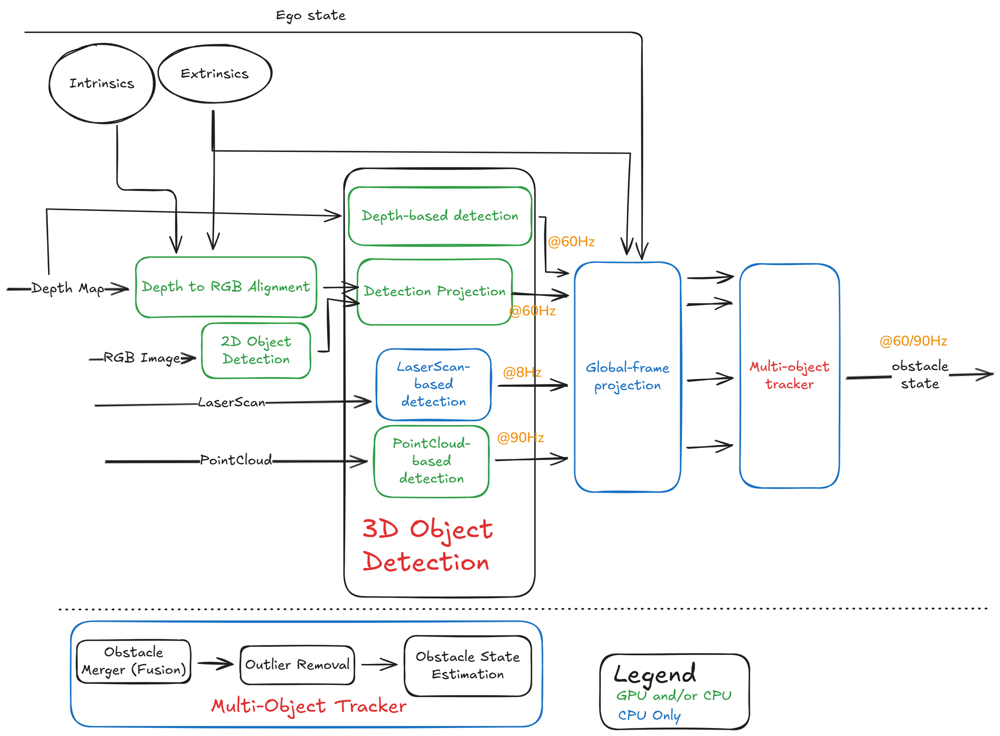

<!--
S50 Perception

Section file for the F1TENTH deck. Slides are separated by a line containing
only `---`. Every slide carries one cut tag; a slide with no tag is
reference-only and appears in `build.sh full` alone.

Conventions (plan §1) - the build enforces the first three:
  - a placeholder card's ID must be listed in ASSETS.md, and an asset marked
    DONE there must be embedded, not carded;
  - no slide body may name an agent file or a bug ID (speaker notes may);
  - every number on a slide needs a note of the form "src: FILE; measured DATE"
    in an HTML comment on that slide;
  - the title is the claim the slide makes, not the topic;
  - rates, latency, resolution and defaults/min/max go in tables, not prose.

Owner: perception chat
Plan rows for this section are quoted above each slide, verbatim from §3.
-->

<!-- cut: lab sponsor research -->
<!-- plan §3 row 5.1 | owner: perception chat -->

## Obstacle detection pipeline

<!--
REFERENCE FIGURE, NOT FINAL. This PNG is an Excalidraw export the planning chat
worked from; it is queued for replacement by an accurate SVG / mermaid / TikZ
drawing (see Open items in ASSETS.md). Two things it needs on the slide either
way: its rate annotations are DESIGN TARGETS, not measurements, so pair it with
the measured table and say so in one line; and check the crop/attribution notes
for this figure in the register before shipping it.
-->

<!--
TODO: write the slide. This comment is the plan, not the slide.

plan content: Excalidraw: 2D detection + depth projection, pointcloud detection, laser detection, merger, tracker
plan source:  Obsidian `2B_ObstacleDetection`

Title must state the claim this slide makes; rewrite it if the plan's
wording is a topic. Put rates/limits/defaults in a table.
Add one note per number:  src: FILE; measured YYYY-MM-DD
-->

---

<!-- cut: lab -->
<!-- plan §3 row 5.2 | owner: perception chat -->

## LaserScan-based detection

> [!PLACEHOLDER FIG-PERC-LASER]
>
> figure not produced yet - see ASSETS.md for how to produce it.

<!--
TODO: write the slide. This comment is the plan, not the slide.

plan content: `autodriver_laser_segmentation` (repo location TBD, D4): method, rate, output type
plan source:  owning repo
NOTE: plan §2a does not say which cuts this belongs to. Scaffold tagged it `lab` only; the section owner must confirm or widen it.

Title must state the claim this slide makes; rewrite it if the plan's
wording is a topic. Put rates/limits/defaults in a table.
Add one note per number:  src: FILE; measured YYYY-MM-DD
-->

---

<!-- cut: lab sponsor research -->
<!-- plan §3 row 5.3 | owner: perception chat -->

## Pointcloud pipeline

> [!PLACEHOLDER FIG-PERC-CLOUD]
>
> figure not produced yet - see ASSETS.md for how to produce it.

<!--
TODO: write the slide. This comment is the plan, not the slide.

plan content: `autodriver_pointcloud_preprocessor` filters then `autodriver_pointcloud_object_detection`; rates on Orin
plan source:  owning repos

Title must state the claim this slide makes; rewrite it if the plan's
wording is a topic. Put rates/limits/defaults in a table.
Add one note per number:  src: FILE; measured YYYY-MM-DD
-->

---

<!-- cut: lab sponsor research -->
<!-- plan §3 row 5.4 | owner: perception chat -->

## Image and 3D

> [!PLACEHOLDER FIG-PERC-IMAGE]
>
> figure not produced yet - see ASSETS.md for how to produce it.

<!--
TODO: write the slide. This comment is the plan, not the slide.

plan content: `autodriver_image_object_detection`: YOLOv8 (ultralytics 8.3.86, onnxruntime-gpu), batch inference + tracking; 2D box to 3D via aligned depth; `ros_multi_object_tracker`
plan source:  owning repos

Title must state the claim this slide makes; rewrite it if the plan's
wording is a topic. Put rates/limits/defaults in a table.
Add one note per number:  src: FILE; measured YYYY-MM-DD
-->

---

<!-- reference-only: no cut tag (plan §3 marks this R) -->
<!-- plan §3 row 5.5 | owner: perception chat -->

## Costmaps as perception

> [!PLACEHOLDER FIG-COSTMAP]
>
> figure not produced yet - see ASSETS.md for how to produce it.

<!--
TODO: write the slide. This comment is the plan, not the slide.

plan content: Nav2 obstacle + inflation layers, `nonpersistent_voxel_layer`; sample costmap
plan source:  `nav2_params.yaml`, `data/maps/sample_costmap.png`

Title must state the claim this slide makes; rewrite it if the plan's
wording is a topic. Put rates/limits/defaults in a table.
Add one note per number:  src: FILE; measured YYYY-MM-DD
-->

---

<!-- reference-only: no cut tag (plan §3 marks this R) -->
<!-- plan §3 row 5.6 | owner: perception chat -->

## Perception demo

> [!PLACEHOLDER VID-PERC-2024]
>
> video not produced yet - see ASSETS.md for how to produce it.

<!--
TODO: write the slide. This comment is the plan, not the slide.

plan content: 2024 clip if allowed (D2); otherwise placeholder
plan source:  `docs/perception_and_gotogoal_planning.mp4`

Title must state the claim this slide makes; rewrite it if the plan's
wording is a topic. Put rates/limits/defaults in a table.
Add one note per number:  src: FILE; measured YYYY-MM-DD
-->

