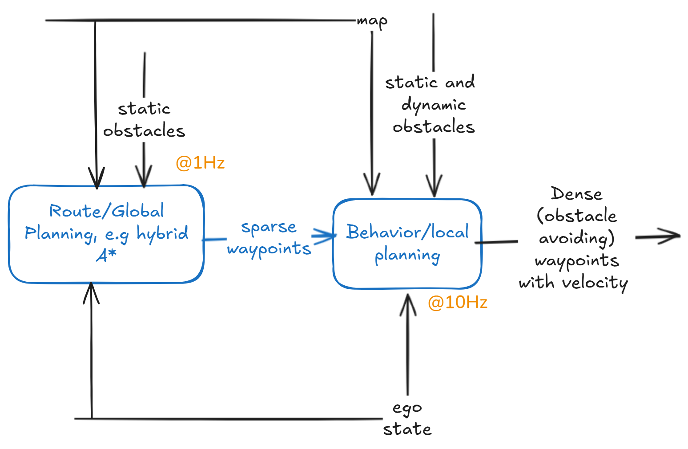

<!--
S60 Planning and Nav2

Section file for the F1TENTH deck. Slides are separated by a line containing
only `---`. Every slide carries one cut tag; a slide with no tag is
reference-only and appears in `build.sh full` alone.

Conventions (plan §1) - the build enforces the first three:
  - a placeholder card's ID must be listed in ASSETS.md, and an asset marked
    DONE there must be embedded, not carded;
  - no slide body may name an agent file or a bug ID (speaker notes may);
  - every number on a slide needs a note of the form "src: FILE; measured DATE"
    in an HTML comment on that slide;
  - the title is the claim the slide makes, not the topic;
  - rates, latency, resolution and defaults/min/max go in tables, not prose.

Owner: shared - rows 6.1/6.3/6.4/6.6 are the launch chat's, 6.2/6.5 the control chat's.
Plan rows for this section are quoted above each slide, verbatim from §3.
-->

<!-- cut: lab sponsor research -->
<!-- _class: cols -->
<!-- plan §3 row 6.1 | owner: launch -->

## Planning is two loops at two rates: a route once a second, a trajectory ten times a second

- **Route planning, 1 Hz** — a global path over the static map, replanned on a timer rather than continuously
- **Behaviour and local planning, 10 Hz** — what the vehicle actually follows, and the only loop the controller sees
- **Sparse vs dense waypoints** — a route is a handful of poses; a trajectory is a dense sequence with a speed at every point

The split matters because replanning is expensive and tracking is not: the global path can afford to be stale, the local one cannot.

<!-- src: figure exported from the Obsidian `3_Planning` note, received 2026-09-02; rates from config/nav2_params.yaml (BT RateController 1.0 Hz, controller_frequency 10.0), read 2026-09-02 -->

---

<!-- cut: lab -->
<!-- plan §3 row 6.2 | owner: control -->

## Waypoint recording and loading

> [!PLACEHOLDER FIG-WAYPOINTS]
>
> figure not produced yet - see ASSETS.md for how to produce it.

<!--
TODO: write the slide. This comment is the plan, not the slide.

plan content: `waypoint_recorder.py` / `waypoint_loader.py`: format, frame, how a figure-8 was recorded
plan source:  trajectory_following_ros2
NOTE: plan §2a does not say which cuts this belongs to. Scaffold tagged it `lab` only; the section owner must confirm or widen it.

Title must state the claim this slide makes; rewrite it if the plan's
wording is a topic. Put rates/limits/defaults in a table.
Add one note per number:  src: FILE; measured YYYY-MM-DD
-->

---

<!-- cut: lab sponsor research -->
<!-- _class: dense cols -->
<!-- plan §3 row 6.3 | owner: launch -->

## Nav2 runs a hybrid-A* planner and a pure-pursuit controller, and any server can be swapped out

| Server | Plugin | Rate |
|---|---|---|
| Planner | Smac Hybrid-A*, Reeds-Shepp | 1 Hz |
| Controller | Regulated Pure Pursuit | 10 Hz |
| Local costmap | LiDAR obstacle + inflation | 5 Hz |
| Global costmap | static + obstacle + inflation | 1 Hz |
| Velocity smoother | open-loop, onto `cmd_vel` | 20 Hz |

Recovery ladder: **clear costmaps → wait 5 s → back up 0.30 m**. No `Spin` — this car cannot rotate in place.

**`twist_to_ackermann`** turns the smoother's `Twist` into a steering command. **Off by default**, because the MPC publishes `drive` directly — enable it for a Nav2 run.

**Any server can be disabled**; replacing the controller with an MPC means implementing `FollowPath`.

<!-- src: config/nav2_params.yaml (GridBased/SmacPlannerHybrid, FollowPath/RegulatedPurePursuitController, controller_frequency 10.0, local costmap update 5.0, global 1.0, smoothing_frequency 20.0), config/behavior_trees/navigate_to_pose_w_replanning_and_recovery.xml, launch/nav2_navigation.launch.py; read 2026-09-02 -->

---

<!-- cut: lab sponsor research -->
<!-- _class: dense -->
<!-- plan §3 row 6.4 | owner: launch -->

## Nav2 drives the car, and stops 0.38 m short of the goal

| Best run, of four goals over three launches | Value | Tolerance |
|---|---|---|
| Commands issued, and reaching the VESC | 203 of 203, over 10.10 s | — |
| Path driven / net displacement | 5.781 m / 4.555 m | — |
| **Final distance to goal** | **0.379 m** | 0.25 m |
| Final heading error | 4.8° | 14.3° |
| Last commanded speed | 0.269 m/s | breakaway 0.20–0.26 m/s |

**Heading converges; position stops 0.38 m short** — pure pursuit decelerates into the band below which this car cannot move. **After a stall the goal stays active and the car was measured deciding to reverse at 0.5 m/s** — cancel it. **Obstacle avoidance is untested.**

> [!PLACEHOLDER CHART-NAV2-APPROACH]
>
> Distance-to-goal and commanded speed against time: the stall, in one figure.

> [!PLACEHOLDER VID-NAV2-LIVE]
>
> The goal sent, the car driving it, and the stall. Needs a driving session.

<!-- src: CLAUDE.md §Nav2 and the nav2_drive4 bag on the SSD; driven on gosling1 2026-08-27. Tolerances from config/nav2_params.yaml (xy_goal_tolerance 0.25, yaw_goal_tolerance 0.25 rad = 14.3 deg), progress checker movement_time_allowance 10.0 restored the same day. -->
<!-- VID-NAV2-LIVE stays uncarded here: the chart is the honest gap. The video is listed in ASSETS.md for the capture session. -->

---

<!-- reference-only: no cut tag (plan §3 marks this R) -->
<!-- plan §3 row 6.5 | owner: control -->

## Go-to-goal: Nav2 vs the MPC node

<!--
TODO: write the slide. This comment is the plan, not the slide.

plan content: The two go-to-goal paths (Nav2 `NavigateToPose`; the MPC node's goal mode), their interfaces, and which has driven the car (the Nav2 run in 6.4 is the only one documented in this repo; the control chat states the MPC node's status)
plan source:  trajectory_following_ros2, CLAUDE.md

Title must state the claim this slide makes; rewrite it if the plan's
wording is a topic. Put rates/limits/defaults in a table.
Add one note per number:  src: FILE; measured YYYY-MM-DD
-->

---

<!-- reference-only: no cut tag (plan §3 marks this R) -->
<!-- plan §3 row 6.6 | owner: launch -->

## On replay the whole stack is healthy — which proves less than it looks

| Measured on a bag replay | Result |
|---|---|
| Goal accepted | 1–2 ms |
| First plan produced | 0.00–0.05 s, against a 5 s planning budget |
| `cmd_vel` output | continuous at 20 Hz, bounded to the configured ±0.5 m/s |
| Recovery subtree | fires and completes |
| Crashes | none |

**What a replay cannot test**: the bag drives the pose, so `SUCCEEDED` only means the *recorded* trajectory passed inside the goal tolerance. Nothing closed-loop is exercised — which is exactly why the live run in the previous slide found a failure the replay never could.

Two artefacts worth knowing: `local_plan` never publishes, because it is a DWB topic and the configured controller is pure pursuit; and the planner peaks near 100 % of a core during `on_configure` (building the global costmap), not while planning, where it sits at 2.5–5.5 %.

<!-- src: scripts/live_runs/NAV2_OFFLINE_RESULTS.md; measured 2026-08-06 -->
