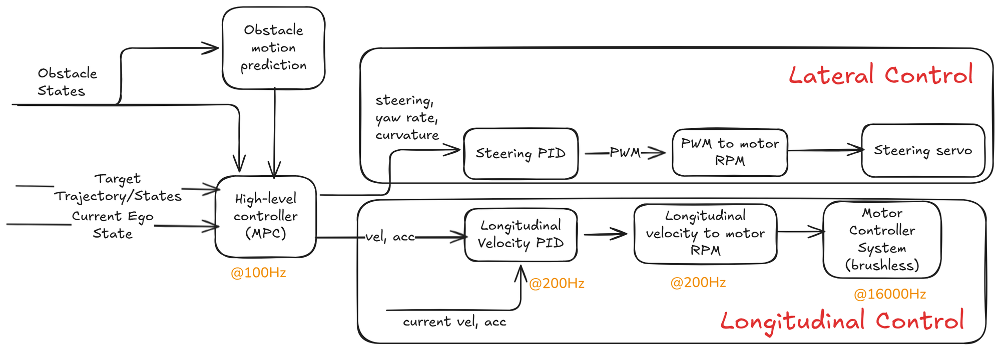

<!--
S70 Hierarchical control

Section file for the F1TENTH deck. Slides are separated by a line containing
only `---`. Every slide carries one cut tag; a slide with no tag is
reference-only and appears in `build.sh full` alone.

Conventions (plan §1) - the build enforces the first three:
  - a placeholder card's ID must be listed in ASSETS.md, and an asset marked
    DONE there must be embedded, not carded;
  - no slide body may name an agent file or a bug ID (speaker notes may);
  - every number on a slide needs a note of the form "src: FILE; measured DATE"
    in an HTML comment on that slide;
  - the title is the claim the slide makes, not the topic;
  - rates, latency, resolution and defaults/min/max go in tables, not prose.

Owner: control chat
Plan rows for this section are quoted above each slide, verbatim from §3.
-->

<!-- cut: lab sponsor research -->
<!-- plan §3 row 7.1 | owner: control chat -->

## Control architecture

<!--
REFERENCE FIGURE, NOT FINAL. This PNG is an Excalidraw export the planning chat
worked from; it is queued for replacement by an accurate SVG / mermaid / TikZ
drawing (see Open items in ASSETS.md). Two things it needs on the slide either
way: its rate annotations are DESIGN TARGETS, not measurements, so pair it with
the measured table and say so in one line; and check the crop/attribution notes
for this figure in the register before shipping it.
-->

<!--
TODO: write the slide. This comment is the plan, not the slide.

plan content: Excalidraw: high-level controller, lateral/longitudinal low-level, rates 100/200/16000 Hz
plan source:  Obsidian `4_Control`

Title must state the claim this slide makes; rewrite it if the plan's
wording is a topic. Put rates/limits/defaults in a table.
Add one note per number:  src: FILE; measured YYYY-MM-DD
-->

---

<!-- cut: lab sponsor research -->
<!-- plan §3 row 7.2 | owner: control chat -->

## High-level controllers

> [!PLACEHOLDER TABLE-CONTROLLERS]
>
> table not produced yet - see ASSETS.md for how to produce it.

<!--
TODO: write the slide. This comment is the plan, not the slide.

plan content: Table: **MPC from `trajectory_following_ros2`** (acados / casadi / do_mpc backends, coupled kinematic model; modes: waypoint following, go-to-goal, obstacle avoidance), pure pursuit (same repo), Nav2 RPP, Nav2 MPPI (secondary, evaluated), joystick. Columns: rate, horizon, model, constraints (delta ±0.314 rad, speed bounds), obstacle-aware, has driven the car
plan source:  trajectory_following_ros2, `nav2_params.yaml`

Title must state the claim this slide makes; rewrite it if the plan's
wording is a topic. Put rates/limits/defaults in a table.
Add one note per number:  src: FILE; measured YYYY-MM-DD
-->

---

<!-- cut: lab sponsor research -->
<!-- plan §3 row 7.3 | owner: control chat -->

## MPC: waypoint following

> [!PLACEHOLDER VID-MPC-RERUN]
>
> video not produced yet - see ASSETS.md for how to produce it.

> [!PLACEHOLDER VID-MPC-LIVE]
>
> video not produced yet - see ASSETS.md for how to produce it.

> [!PLACEHOLDER CHART-MPC-TRACKING]
>
> chart not produced yet - see ASSETS.md for how to produce it.

<!--
TODO: write the slide. This comment is the plan, not the slide.

plan content: Offline figure-8 and loop runs (rerun recordings) and live drives; tracking error chart; acceptance `k ≈ 0.96`; LUCIO ego-MPC one line
plan source:  control chat, `SYSID_RESULTS.md`

Title must state the claim this slide makes; rewrite it if the plan's
wording is a topic. Put rates/limits/defaults in a table.
Add one note per number:  src: FILE; measured YYYY-MM-DD
-->

---

<!-- cut: lab sponsor research -->
<!-- plan §3 row 7.4 | owner: control chat -->

## MPC: go-to-goal and obstacle avoidance

> [!PLACEHOLDER VID-MPC-OBST-RVIZ]
>
> video not produced yet - see ASSETS.md for how to produce it.

> [!PLACEHOLDER VID-MPC-OBST-LIVE]
>
> video not produced yet - see ASSETS.md for how to produce it.

<!--
TODO: write the slide. This comment is the plan, not the slide.

plan content: How obstacles enter the problem (constraints or cost), what the obstacle source is today (`autodriver_fake_obstacle_publisher` vs perception), RViz and live placeholders with and without obstacles
plan source:  control chat

Title must state the claim this slide makes; rewrite it if the plan's
wording is a topic. Put rates/limits/defaults in a table.
Add one note per number:  src: FILE; measured YYYY-MM-DD
-->

---

<!-- reference-only: no cut tag (plan §3 marks this R) -->
<!-- plan §3 row 7.4b | owner: control chat -->

## Nav2 MPPI

<!--
TODO: write the slide. This comment is the plan, not the slide.

plan content: Configuration tried, result, why it is secondary
plan source:  control chat, `nav2_params.yaml`

Title must state the claim this slide makes; rewrite it if the plan's
wording is a topic. Put rates/limits/defaults in a table.
Add one note per number:  src: FILE; measured YYYY-MM-DD
-->

---

<!-- cut: lab sponsor research -->
<!-- plan §3 row 7.5 | owner: vesc chat -->

## Low-level actuation chain

> [!PLACEHOLDER FIG-LOWLEVEL]
>
> diagram not produced yet - see ASSETS.md for how to produce it.

<!--
TODO: write the slide. This comment is the plan, not the slide.

plan content: `ackermann_to_vesc`: erpm = 3750 v, servo = -1.1448 delta + 0.56, clamp [0.08, 0.92]; saturator; optional closed-loop speed PI (`speed_kp/ki`, anti-windup), adaptive FF, accel FF, rate limit, all default off; `throttle_interpolator` (fixed, optional). Owner confirms whether a steering PID exists (template: "confirm from my vesc fork")
plan source:  `vesc.yaml`, `bringup.launch.py`, vesc fork

Title must state the claim this slide makes; rewrite it if the plan's
wording is a topic. Put rates/limits/defaults in a table.
Add one note per number:  src: FILE; measured YYYY-MM-DD
-->

---

<!-- reference-only: no cut tag (plan §3 marks this R) -->
<!-- plan §3 row 7.6 | owner: vesc chat -->

## Actuation lag

> [!PLACEHOLDER CHART-LAG]
>
> chart not produced yet - see ASSETS.md for how to produce it.

<!--
TODO: write the slide. This comment is the plan, not the slide.

plan content: 60 ms delay + 40 ms first-order; throttle transport <20 ms; step-response plot
plan source:  `SYSID_RESULTS.md`

Title must state the claim this slide makes; rewrite it if the plan's
wording is a topic. Put rates/limits/defaults in a table.
Add one note per number:  src: FILE; measured YYYY-MM-DD
-->

---

<!-- reference-only: no cut tag (plan §3 marks this R) -->
<!-- plan §3 row 7.7 | owner: control chat -->

## Pure pursuit details

<!--
TODO: write the slide. This comment is the plan, not the slide.

plan content: lookahead, gains
plan source:  control chat

Title must state the claim this slide makes; rewrite it if the plan's
wording is a topic. Put rates/limits/defaults in a table.
Add one note per number:  src: FILE; measured YYYY-MM-DD
-->

---

<!-- reference-only: no cut tag (plan §3 marks this R) -->
<!-- plan §3 row 7.8 | owner: control chat -->

## Joystick as a controller

> [!PLACEHOLDER PHOTO-DUALSENSE]
>
> photo not produced yet - see ASSETS.md for how to produce it.

<!--
TODO: write the slide. This comment is the plan, not the slide.

plan content: joy_teleop mapping, `max_speed`, `max_steering` 0.314
plan source:  `joy_teleop.yaml`, `joystick.launch.py`

Title must state the claim this slide makes; rewrite it if the plan's
wording is a topic. Put rates/limits/defaults in a table.
Add one note per number:  src: FILE; measured YYYY-MM-DD
-->

