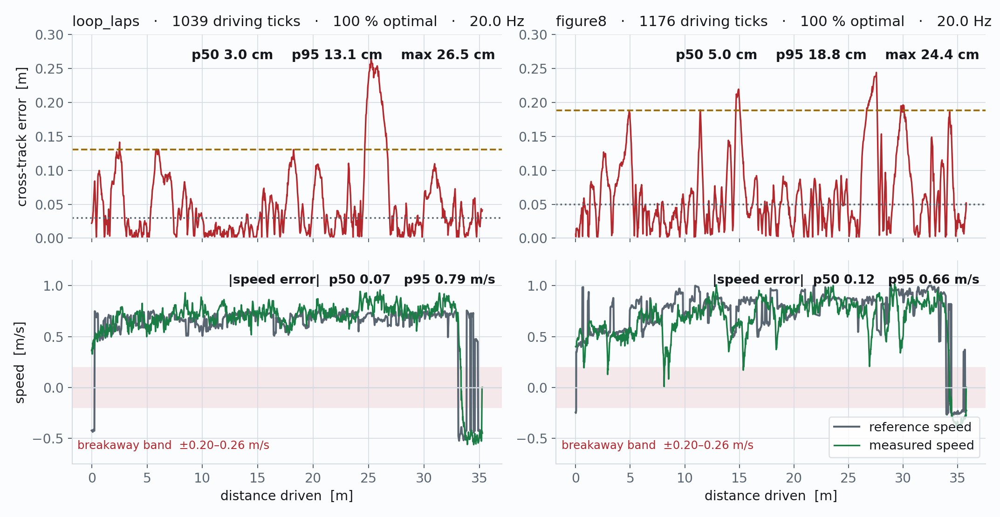

<!--
S70 Hierarchical control

Section file for the F1TENTH deck. Slides are separated by a line containing
only `---`. Every slide carries one cut tag; a slide with no tag is
reference-only and appears in `build.sh full` alone.

Conventions (plan §1) - the build enforces the first three:
  - a placeholder card's ID must be listed in ASSETS.md, and an asset marked
    DONE there must be embedded, not carded;
  - no slide body may name an agent file or a bug ID (speaker notes may);
  - every number on a slide needs a note of the form "src: FILE; measured DATE"
    in an HTML comment on that slide;
  - the title is the claim the slide makes, not the topic;
  - rates, latency, resolution and defaults/min/max go in tables, not prose.

Owner: control chat
Plan rows for this section are quoted above each slide, verbatim from §3.
-->

<!-- cut: lab sponsor research -->
<!-- _class: cols -->
<!-- plan §3 row 7.1 | owner: control chat -->

## Control is a cascade, and only its top level is ours to design

| Level | Decides | Rate |
|---|---|---|
| High-level controller | speed + steering **angle** | **20.0 Hz measured** |
| Steering | servo position from angle | affine map, see 7.5 |
| Longitudinal | ERPM from speed | VESC closed loop |

Only the top level is written in this project. What it publishes is a **speed and a steering angle** — never a torque, never a servo position — so every loop below it belongs to the actuation chain, and a commanded angle past what the servo delivers is clipped there **silently**.

**The figure is design intent, not a measurement.** Its rate annotations are targets, and it draws inner loops whose presence slides 7.5–7.6 settle. The only rate measured on the car is the 20.0 Hz control tick.

<!-- src: control tick from the per-solve log of the 2026-08-06 gosling1 legs (tick_interval_ms p50 50.00 ms over 14322 and 3669 ticks); servo map servo = -1.1448*delta + 0.56 from the 2026-08-07 recalibration relayed 2026-08-09. -->

<!--
REFERENCE FIGURE, NOT FINAL. This PNG is an Excalidraw export the planning chat
worked from; it is queued for replacement by an accurate SVG / mermaid / TikZ
drawing (see Open items in ASSETS.md). Two things it needs on the slide either
way: its rate annotations are DESIGN TARGETS, not measurements, so pair it with
the measured table and say so in one line; and check the crop/attribution notes
for this figure in the register before shipping it.
-->

---
<!-- cut: lab sponsor research -->
<!-- _class: dense -->
<!-- plan §3 row 7.2 | owner: control chat -->

## Six high-level controllers are wired; three of them have driven this car

| Controller | Rate | Horizon | Model | Constraints | Obstacle-aware | Driven the car |
|---|---|---|---|---|---|---|
| **MPC — acados** | 20 Hz | 25 steps / 1.25 s | kinematic bicycle, rear axle | δ ±18°, v ±1.0 m/s, a ±3 m/s², stage-0 steer-rate box | yes, per-disc keep-out | **yes** |
| MPC — CasADi | 20 Hz | 25 / 1.25 s | same | same, plus a control-barrier variant (interior-point only) | yes | no — bench only |
| MPC — do_mpc | 9.7 Hz on the Orin | 25 / 1.25 s | same | same, **no obstacle rows** | no | no — misses the budget |
| Pure pursuit | 20 Hz | geometric | lookahead + PID speed | steering saturation only | no | no — earlier stack |
| Nav2 RPP | 10 Hz | geometric | lookahead 0.6 m (0.3–3.0) | v 0.5 m/s, ang. accel 3.0 rad/s² | costmap | **yes** |
| Nav2 MPPI | configured | 56 × 0.05 s = 2.8 s | sampling, 2000 rollouts | costmap | costmap | no — not the selected plugin |
| Joystick | — | — | — | steering ±0.314 rad | no | **yes** |

**δ ±18° is ±0.314 rad, and that is not a coincidence.** The cap is the measured servo travel, not a mechanical lock — so every cross-track number recorded before it was applied is a floor, not a measurement.

<!-- src: horizon 25 / sample_time 0.05 / max_steer 18.0 / max_speed 1.0 from config/weights/gosling1_acados_recal.yaml; wheelbase 0.256, control_rate 20.0, max_accel 3.0 from config/platforms/f1tenth.yaml (trajectory_following_ros2, branch refactor/unify-backends, read 2026-09-03). do_mpc 9.65 Hz measured on the Orin Nano 2026-08-04. Nav2 rows from config/nav2_params.yaml (controller_frequency 10.0, lookahead_dist 0.6, min 0.3, max 3.0, desired_linear_vel 0.5, max_angular_accel 3.0; MPPI time_steps 56, model_dt 0.05, batch_size 2000; active plugin is RegulatedPurePursuitController), read 2026-09-03. Nav2 "driven" from slide 6.4, gosling1 2026-08-27. Servo travel +24.02 deg left / -18.02 deg right measured 2026-08-07, cap applied 2026-08-09. -->
<!-- OWNERSHIP: the two Nav2 rows are the f1tenth_launch chat's material. Filled here from
     nav2_params.yaml as read, rather than left as holes on a core slide - they should confirm.
     The one thing this repo genuinely cannot supply is an MPPI *result*: it is configured but
     is not the selected plugin, and no run of it exists here. That gap is 7.4b. -->
<!-- CONFIRMED by the f1tenth_launch chat, 2026-09-03, re-read from config/nav2_params.yaml:
     RPP controller_frequency 10.0 (:85), lookahead_dist 0.6 / min 0.3 / max 3.0 (:140-142),
     desired_linear_vel 0.5 (:136), max_angular_accel 3.0 (:139), plugin
     RegulatedPurePursuitController (:130) with use_collision_detection: true (:150) - which is
     what the costmap entry in the obstacle column rests on. MPPI time_steps 56 (:168),
     model_dt 0.05 (:169), batch_size 2000 (:170). All seven values as written. Two notes for
     7.4b, not for this table: MPPI carries its own vx_max 0.75 (:174), NOT the RPP 0.5; and its
     AckermannConstraints min_turning_r is 0.462 (:191), derived from 30 deg of steering, while
     this car has 18 deg -> 0.788 m. That value is inert only because RPP is the selected
     plugin; it is wrong the moment anyone switches to MPPI. -->

---
<!-- reference-only: no cut tag (added by the control chat; see the hand-back) -->
<!-- plan §3 row 7.2b | owner: control chat -->
<!-- _class: dense -->

## Obstacles enter the MPC as slacked keep-out rows, not as a cost term

| Piece | What it is |
|---|---|
| State / input | `x = [x, y, v, ψ]`, `u = [a, δ]`; kinematic bicycle at the rear axle, RK4 one-step map |
| Cost | diagonal `Q = [100, 100, 100, 16]`, `Qf = [200, 200, 200, 40]`, `R = [0.01, 0.01]`, **`Rd` (input rate) `= [10, 10]`** |
| Constraints | input box; steering rate as a **stage-0 box tightened each tick** to `u_prev ± r·dt` — hard, and never infeasible |
| Keep-out | `dist ≥ ego_radius + obstacle_radius + safe_distance`, slacked, one row per disc per obstacle per stage |
| Ego cover | **two** discs, r 0.212 m at offsets 0.045 / 0.335 m — one rear-axle disc lets the front corner clip at *positive* clearance |

- **The cost type is a formulation choice, not a tuning knob.** `Rd` and the keep-out rows exist only in the external-cost branch; the least-squares types drop both silently.
- **The reference is shaped too**, not just the constraint: points inside a keep-out are projected onto its boundary with go-around hysteresis. Without the projection an on-path obstacle deadlocks the solver; without the hysteresis the go-around side flips tick to tick.
- **The plant's floor sits above the controller's ceiling.** From rest the published speed is the one-step state `v + a·dt`, capped at `max_accel·dt` = **0.15 m/s** — under the **0.20–0.26 m/s** this drivetrain needs to move. A latched breakaway floor shortens each stall; it does not remove it.
- **Jerk is deliberately left unbounded** — a comfort weight, not an actuator limit. Bounding it at 1.5 m/s³ moves acceleration 0.075 m/s² per tick and starves the input: 0 solver failures became 12.

<!-- src: Q/Qf/R/Rd, horizon and steering cap from config/weights/gosling1_acados_recal.yaml; wheelbase 0.256, ego_radius 0.212, ego_disc_offsets [0.045, 0.335], safe_distance 0.15 from config/platforms/f1tenth.yaml (trajectory_following_ros2, branch refactor/unify-backends, read 2026-09-03). Breakaway 0.18 m/s on stands / 0.20-0.26 m/s on the ground, measured on gosling1 2026-08-07 (speed staircase) and 2026-08-08 (ground A/B); max_accel 3.0 and the breakaway block are in config/platforms/f1tenth.yaml. Jerk-bound measurement from the hairpin rollout, 900 ticks, recorded 2026-07-13. Front-disc encroachment of 0.291 m at positive reported clearance measured 2026-07-20. -->

---
<!-- cut: lab sponsor research -->
<!-- _class: cols dense -->
<!-- plan §3 row 7.3 | owner: control chat -->

## The MPC drove both recorded routes end to end, every solve optimal

| Live leg | loop | figure-8 |
|---|---|---|
| Cross-track p50 / p95 | **3.0 / 13.1 cm** | 5.0 / 18.8 cm |
| Optimal solves, tick | 100 %, 20.0 Hz | 100 %, 20.0 Hz |

<video src="../assets/video/VID-MPC-LIVE.mp4" poster="../assets/figures/control/vid_mpc_live_poster.jpg" controls width="255"></video>

<video src="../assets/video/VID-MPC-RERUN.mp4" poster="../assets/figures/control/vid_mpc_rerun_poster.jpg" controls width="255"></video>

Both routes reached their goal and latched it, reverse tail included — driven, not trimmed.

**These legs predate the measured steering cap, so the numbers are a floor.** The one leg driven under it tracks to 4.4 cm median.

<!-- src: cross-track, cadence and optimal-solve fractions computed 2026-09-03 from the per-solve logs of the two gosling1 hardware legs of 2026-08-06 (loop 14322 ticks / 1039 after route acquisition; figure-8 3669 / 1176), projected onto data/gosling1_loop_laps.csv and data/gosling1_figure8.csv in trajectory_following_ros2. The 4.4 cm median is the 2026-08-10 figure-8 leg under the +/-18 deg cap, recovered from data/fig8_video/figure8_leg1_mapfixed.rrd (270 pose samples). -->
<!-- Statistics are over route-acquired ticks. The operator drives in deadman bursts, so a
     whole-run distribution is dominated by ticks parked at the route start: it reports
     p95 4.5 cm for the loop, which flatters the controller. 13.1 cm is the honest figure. -->
<!-- The k = 0.96 acceptance band in the plan is a STEERING-CALIBRATION criterion
     (scripts/live_runs/SYSID_RESULTS.md, agreed 2026-08-08, band 0.95-1.02), not an MPC
     tracking metric - it belongs on the sysid slides, so it is not quoted here. -->

---
<!-- cut: lab sponsor research -->
<!-- _class: dense -->
<!-- plan §3 row 7.4 | owner: control chat -->

## Two of the MPC's three modes have driven the car; obstacle avoidance never has

| Mode | Where it has run | Interface |
|---|---|---|
| **Waypoint following** | **on the car**, both recorded routes, 2026-08-06 and 2026-08-10 | latched path + signed speed array |
| **Go-to-goal** | **simulator only**, 2026-08-08 | a live-replanned path; forward-only Dubins curves from a stand-in planner |
| **Obstacle avoidance** | **simulation and replay only** | object array in the global frame |

**The obstacle source today is not perception.** It is a synthetic publisher, or recorded object arrays replayed from an earlier urban-simulator session. Nothing in this path has consumed a live detection on this car.

**Obstacles enter as constraints, not as cost** — a slacked keep-out per ego disc, per obstacle, per stage, with the reference projected out of the keep-out alongside it. Detail is on the formulation slide.

> [!PLACEHOLDER VID-MPC-OBST-RVIZ]
>
> MPC avoiding an obstacle in RViz. Not captured: no obstacle run exists on this car.

> [!PLACEHOLDER VID-MPC-OBST-LIVE]
>
> MPC avoiding an obstacle on the car. Needs a driving session with an obstacle feed.

<!-- src: mode status from the trajectory_following_ros2 branch refactor/unify-backends as read 2026-09-03 - go-to-goal via tools/goal_to_plan.py (plan_type dubins, min_turn_radius 0.5 m) against the closed-loop simulator, first run 2026-08-08; obstacle sources are fake_obstacle_publisher.py and obstacle_replay_publisher.py. Live hardware legs 2026-08-06 and 2026-08-10. -->
<!-- rviz_obstacle_detection.mp4 was offered for VID-MPC-OBST-RVIZ and is NOT it: it shows
     clustered-pointcloud detection in base_link with no MPC path and no keep-out drawn.
     It is a perception asset. See the hand-back. -->

---

<!-- reference-only: no cut tag (plan §3 marks this R) -->
<!-- plan §3 row 7.4b | owner: control chat -->

## Nav2 MPPI

<!--
TODO: write the slide. This comment is the plan, not the slide.

plan content: Configuration tried, result, why it is secondary
plan source:  control chat, `nav2_params.yaml`

Title must state the claim this slide makes; rewrite it if the plan's
wording is a topic. Put rates/limits/defaults in a table.
Add one note per number:  src: FILE; measured YYYY-MM-DD
-->

---

<!-- cut: lab sponsor research -->
<!-- plan §3 row 7.5 | owner: vesc chat -->

## Low-level actuation chain

> [!PLACEHOLDER FIG-LOWLEVEL]
>
> diagram not produced yet - see ASSETS.md for how to produce it.

<!--
TODO: write the slide. This comment is the plan, not the slide.

plan content: `ackermann_to_vesc`: erpm = 3750 v, servo = -1.1448 delta + 0.56, clamp [0.08, 0.92]; saturator; optional closed-loop speed PI (`speed_kp/ki`, anti-windup), adaptive FF, accel FF, rate limit, all default off; `throttle_interpolator` (fixed, optional). Owner confirms whether a steering PID exists (template: "confirm from my vesc fork")
plan source:  `vesc.yaml`, `bringup.launch.py`, vesc fork

Title must state the claim this slide makes; rewrite it if the plan's
wording is a topic. Put rates/limits/defaults in a table.
Add one note per number:  src: FILE; measured YYYY-MM-DD
-->

---

<!-- reference-only: no cut tag (plan §3 marks this R) -->
<!-- plan §3 row 7.6 | owner: vesc chat -->

## Actuation lag

> [!PLACEHOLDER CHART-LAG]
>
> chart not produced yet - see ASSETS.md for how to produce it.

<!--
TODO: write the slide. This comment is the plan, not the slide.

plan content: 60 ms delay + 40 ms first-order; throttle transport <20 ms; step-response plot
plan source:  `SYSID_RESULTS.md`

Title must state the claim this slide makes; rewrite it if the plan's
wording is a topic. Put rates/limits/defaults in a table.
Add one note per number:  src: FILE; measured YYYY-MM-DD
-->

---
<!-- reference-only: no cut tag (plan §3 marks this R) -->
<!-- plan §3 row 7.7 | owner: control chat -->

## Pure pursuit is wired and geometric, but it has not driven the 2026 car

| Parameter | Default | Meaning |
|---|---|---|
| `lookahead_distance` | 0.4 m | base lookahead |
| `min_lookahead` / `max_lookahead` | 0.3 / 10.452 m | clamp on the adaptive value |
| `adaptive_lookahead_gain` | 0.4 s | lookahead grows as `gain·v + base`; **off by default** |
| `speed_Kp` / `Ki` / `Kd` | 2.0 / 0.2 / 0.0 | PID on speed |
| odometry topic | `odometry/filtered` | differs from the MPC nodes, which use `odometry/local` |

Steering is one line of geometry — `δ = atan2(2·L·sin α, ℓ)` for lookahead `ℓ` and the angle `α` to the lookahead point. The geometry is plain Python; the node owns only the ROS wiring, and it **replaces the control loop wholesale** rather than supplying a solver to the shared one.

**Status: simulation and the earlier stack only.** It has never been run on the 2026 car, so no tracking number for it appears anywhere in this deck.

<!-- src: parameter defaults from trajectory_following_ros2/ackermann_purepursuit.py and purepursuit/PurePursuit.py, branch refactor/unify-backends, read 2026-09-03. -->

<!--
PLAN ROW 7.8 (joystick as a controller) IS RETIRED - Phase-G arbitration, 2026-09-03.

The control hand-back flagged an ownership disagreement on this row: the scaffold
marked it `owner: control chat`, BRIEF_trajectory_following §1 assigned it to the
f1tenth_launch chat, and BRIEF_f1tenth_launch §1 did not list it at all. Settled by
reading what it would contain: `joy_teleop.yaml` axis mappings, `max_speed`,
`max_steering` 0.314 and PHOTO-DUALSENSE are ALREADY on slide 8.4, written from the
same two files. 7.8 would have been a duplicate in a different section, so the row is
dropped rather than reassigned. Anyone looking for the joystick-as-controller material
should go to 8.4 (and 1.6 for the SDL button numbering).

Consequence: PHOTO-DUALSENSE is now DONE in ASSETS.md - nothing cards it any more.
-->
