<!--
S80 Vehicle interface and safety

Section file for the F1TENTH deck. Slides are separated by a line containing
only `---`. Every slide carries one cut tag; a slide with no tag is
reference-only and appears in `build.sh full` alone.

Conventions (plan §1) - the build enforces the first three:
  - a placeholder card's ID must be listed in ASSETS.md, and an asset marked
    DONE there must be embedded, not carded;
  - no slide body may name an agent file or a bug ID (speaker notes may);
  - every number on a slide needs a note of the form "src: FILE; measured DATE"
    in an HTML comment on that slide;
  - the title is the claim the slide makes, not the topic;
  - rates, latency, resolution and defaults/min/max go in tables, not prose.

Owner: B1 (f1tenth_launch)
Plan rows for this section are quoted above each slide, verbatim from §3.
-->

<!-- cut: lab sponsor research -->
<!-- _class: dense -->
<!-- plan §3 row 8.1 | owner: B1 (f1tenth_launch) -->

## No command reaches the motor without passing a priority mux and a heartbeat gate

| Mux channel | Topic | Priority | Timeout | Who publishes it |
|---|---|---|---|---|
| `estop` | `estop` | 255 | 0.5 s | the joystick's stop control |
| `joystick` | `teleop` | 100 | 0.3 s | `joy_teleop`, only while a deadman is held |
| `navigation` | `drive` | 10 | 0.2 s | Nav2 (via `twist_to_ackermann`) or the MPC |
| `safety` | `safety` | 1 | 0.05 s | an always-on 40 Hz zero-speed publisher |

**The highest-priority channel that published inside its timeout wins**, so `safety` takes over only when every other channel has gone quiet. Startup protection is the gate's job, not the mux's: it starts *closed*.

<!-- src: config/vehicle/mux.yaml, config/vehicle/command_gate.yaml, launch/vehicle/ackermann_mux.launch.py (40 Hz safety publisher); read 2026-09-02 -->

---

<!-- cut: lab sponsor research -->
<!-- _class: dense -->
<!-- plan §3 row 8.2 | owner: B1 (f1tenth_launch) -->

## The deadman is a heartbeat on its own topic, and that is not an implementation detail

| Timing | Value | Where it comes from |
|---|---|---|
| Heartbeat topic | `command_gate/heartbeat`, `Float64` — only arrival counts | dedicated, not a command topic |
| Heartbeat timeout | 0.5 s | worst measured gap is 0.136 s |
| Gate closes after joystick loss | 0.5–0.63 s | disconnect, battery death, node crash |
| Commanded motion after loss | ~0.2–0.35 s | the mux hands to `safety` at +0.3 s |

**Why the heartbeat needs its own topic**: holding the autonomous deadman silences the teleop command *by design* — that silence is what lets the mux hand over to `drive`. A heartbeat carried on that topic starves at the same instant, closing the gate a second into every autonomous run.

**Why the mux gives the joystick 0.3 s, not 0.1 s**: the pad publishes event-driven at ~12.2 Hz idle, and jitter stretches an interval to 0.103 s. At 0.1 s its priority-100 claim lapsed **155 times a minute while parked**, letting `navigation` take the vehicle for milliseconds at a time. **A timeout must exceed its source's worst case, not its average.**

> [!PLACEHOLDER VID-SAFETY-MUX]
>
> Deadman released mid-drive: the car stops, the mux's active channel changes on screen.

<!-- src: config/vehicle/command_gate.yaml, config/vehicle/mux.yaml, config/vehicle/joy_teleop.yaml (heartbeat_idle / heartbeat_deadman); timings measured on gosling1 2026-08-04 and 2026-08-05 -->

---

<!-- cut: lab -->
<!-- _class: dense -->
<!-- plan §3 row 8.3 | owner: B1 (f1tenth_launch) -->

## Power-up order exists because the two supplies must not meet through a USB ground

| Phase | Steps |
|---|---|
| **Pre-op** | inspect the packs; charge ESC, computer and controller packs to full; confirm no shorts |
| **Power up** | DC jack to the computer → sensors to the computer → LiPo to the ESC via XT90 → ESC micro-USB to the **USB isolator** → isolator to the computer |
| **Confirm** | computer power LED solid green; ESC status LED solid red; isolator LED solid red |
| **Normal operation** | actuators respond when armed; the LiDAR is spinning |
| **Shutdown** | Ctrl-C the launch (allow ~4 s for actuators and sensors to stop) → shut the computer down → disconnect the packs, ESC first |
| **Emergency** | lift the car off the ground → disconnect the ESC from the battery → pull the DC jack |

**Battery care**: store the LiPo at 11.3 V; the ESC enforces its own under-voltage and current limits; the NP-F adapter protects the computer pack. The controller shuts itself off when low.

<!-- src: docs/F1tenthDocumentation_v1_1_Release.md §Operating Procedures, §Battery Management, §Wiring; read 2026-09-02 -->

---

<!-- cut: lab sponsor -->
<!-- _class: dense -->
<!-- plan §3 row 8.4 | owner: B1 (f1tenth_launch) -->

## Two sticks and three buttons: everything else about driving this car is software

| Control | Axis / button | Scale |
|---|---|---|
| Speed | left stick vertical (axis 1) | ±5.0 m/s at the joystick — the launch argument overwrites the value in the config file |
| Steering | right stick horizontal (axis 2) | ±0.314 rad (18.0°) — the largest symmetric command that never clips the servo |
| Manual deadman | L1 (9) or Share (4) | commands flow only while held |
| Autonomous handover | R1 (10) | teleop goes silent, `drive` takes the mux, the heartbeat continues |

<!-- src: config/vehicle/joy_teleop.yaml axis mappings, launch/vehicle/joystick.launch.py (max_speed 5.0, max_steering 0.314, deadman_buttons [4, 9], autonomous_deadman_buttons [10]); steering limit measured 2026-08-07, applied 2026-08-26 -->

---

<!-- reference-only: no cut tag (plan §3 marks this R) -->
<!-- _class: dense -->
<!-- plan §3 row 8.5 | owner: B1 (f1tenth_launch) -->

## The gate has three configurations, and the third one hands you the responsibility

| Configuration | Arguments | What you get |
|---|---|---|
| **Full safety** (default) | `launch_command_gate:=True`, `command_gate_require_heartbeat:=True` | gate starts closed, opens on the heartbeat, closes 0.5 s after it stops |
| **Transparent passthrough** | gate launched, both `require_heartbeat` and `require_enable` False | the gate is present and its logic collapses to always-open |
| **No gate** | `launch_command_gate:=False` | **you** must publish the VESC's input topic — the mux has no route to the motor without it |

Two things that surprise people:

- `require_heartbeat:=False` **opens** the gate permanently. To hold it shut for a bench test, disconnect the joystick instead.
- A closed gate keeps publishing at full rate, with zero payloads. **Checking the topic's frequency tells you nothing** — echo the values.

<!-- src: config/vehicle/command_gate.yaml, launch/vehicle/command_gate.launch.py, launch/bringup.launch.py (command_gate_require_heartbeat:=True); read 2026-09-02 -->

---

<!-- reference-only: no cut tag (plan §3 marks this R) -->
<!-- plan §3 row 8.6 | owner: B1 (f1tenth_launch) -->

## Interrupting the launch does not stop the nodes that matter most

`ros2 launch` forwards the interrupt, but a node blocked in a **device read** never reaches its handler. The joystick node and the ESC driver both routinely outlive the parent, reparent to init, and keep publishing — while the shell appears to hang.

The orphans then make the *next* run look like the launch file is duplicating subsystems.

| The teardown helper does | Because |
|---|---|
| snapshots the process tree **before** signalling | once the parent dies its children reparent, and a later walk finds nothing |
| escalates interrupt → terminate → kill, with a bounded wait per stage | a device-blocked node needs the escalation; a healthy one must not be killed early |
| sweeps survivors **by PID** | a blanket kill by name would take out another operator's stack or an external controller on the same machine |
| gives the 3D mapper a longer grace period | it needs up to 180 s to flush its database |

<!-- src: scripts/live_runs/00_env.sh stop_launch_tree(); orphan behaviour observed on gosling1, helper landed 2026-09-01 -->
