<!--
S90 System identification and calibration

Section file for the F1TENTH deck. Slides are separated by a line containing
only `---`. Every slide carries one cut tag; a slide with no tag is
reference-only and appears in `build.sh full` alone.

Conventions (plan §1) - the build enforces the first three:
  - a placeholder card's ID must be listed in ASSETS.md, and an asset marked
    DONE there must be embedded, not carded;
  - no slide body may name an agent file or a bug ID (speaker notes may);
  - every number on a slide needs a note of the form "src: FILE; measured DATE"
    in an HTML comment on that slide;
  - the title is the claim the slide makes, not the topic;
  - rates, latency, resolution and defaults/min/max go in tables, not prose.

Owner: B2 (f1tenth_launch)
Plan rows for this section are quoted above each slide, verbatim from §3.
-->

<!-- cut: lab sponsor research -->
<!-- _class: dense -->
<!-- plan §3 row 9.1 | owner: B2 (f1tenth_launch) -->

## Every constant in the vehicle interface arrived from a different car; four of seven are still inherited

| Constant | Value | Status | Method and date |
|---|---|---|---|
| `steering_angle_to_servo_gain` | −1.1448 | measured on this car | fitted from driven bags, 2026-08-07; re-confirmed independently 2026-09-01 |
| `steering_angle_to_servo_offset` | 0.5600 | contested | 2026-08-07 fits agreed (0.5591 / 0.5610); three 2026-09-01 fits all land lower (0.5508–0.5583) |
| `wheelbase` | 0.256 m | aligned | matched to the frame tree and every other consumer, 2026-08-07 |
| `speed_to_erpm_gain` | 3750 | corroborated, not measured | driven fits span 3687–4022; good to about 7 %, 2026-09-01 |
| `speed_to_erpm_offset` | 0.0 | must stay zero | it is applied unconditionally, so a non-zero value makes a commanded stop creep |
| `servo_min` / `servo_max` | 0.08 / 0.92 | inherited, unmeasured | never reached in six bags; the bench sweep would settle them |

**The steering limit `max_steering = 0.314 rad` is not in this file** — it is a launch argument, and it is what actually bounds the car.

<!-- src: config/vehicle/vesc.yaml read 2026-09-02; scripts/live_runs/SYSID_RESULTS.md for every fit and date -->

---

<!-- cut: lab research -->
<!-- _class: cols -->
<!-- plan §3 row 9.2 | owner: B2 (f1tenth_launch) -->

## Calibration is scored in servo units against a reference the actuator cannot influence

- **Drive the car with structured excitation**, and record a bag with **no image topics** — recording pixels starves the very odometry the fit needs
- **Score in servo units, not radians.** The fit then inherits none of the constants it is trying to measure — including the one being fitted
- **Use more than one reference.** Two that each score R² ≈ 0.99 still disagreed by 6.3 %, and only a tape measure broke the tie
- **Refuse bags that carry no information.** One run was rejected because two independent references agreed the car had not moved — the motor turned, the wheels were off the ground

<!-- src: scripts/analysis/fit_actuators.py, scripts/live_runs/SYSID_RESULTS.md; bag rejection and the reference disagreement both 2026-09-01 -->

---

<!-- cut: lab sponsor research -->
<!-- _class: dense -->
<!-- plan §3 row 9.3 | owner: B2 (f1tenth_launch) -->

## Steering was over-commanding by ~20 %; corrected, the car now delivers 97 % of what it is told

| Quantity | Result | Note |
|---|---|---|
| Gain, before / after | −1.4 → **−1.1448** | the old value over-steered by 18–23 % |
| Achieved / commanded after correction | **0.999 and 0.991** | two bags, 0.85 % apart, 2026-09-01 |
| Full-lock angle achieved, left / right | **17.45° / 17.47°** | symmetric to 0.1 % |
| Minimum turning radius, driven | **0.814 m** | at the current command limit |
| Fraction of commanded angle delivered at the bound | **97.0 %** both sides | the mechanism is not the limitation |
| Offset, configured vs three later fits | 0.5600 vs 0.5508–0.5583 | at 0.5508 a *zero* command asks for −0.46°: **47 cm of lateral drift over 5.5 m** |

**What is actually limiting the turn is the command limit, not the car.** `max_steering = 0.314 rad` clips neither side. **Left has 0.12 servo units of headroom** — up to 24.0°, which would tighten the left turn to about 0.60 m — while **right sits 0.0005 from its configured bound and has none.** Using the headroom means going asymmetric, which is a cross-repo change, or first measuring whether the inherited servo bounds are real.

> [!PLACEHOLDER CHART-STEER]
>
> Commanded against achieved steering, per direction, from the sweep and loop bags.

<!-- src: scripts/live_runs/SYSID_RESULTS.md; gain applied 2026-08-07, bounds driven on armA_steer_sweep 2026-09-01 -->

---

<!-- cut: lab sponsor research -->
<!-- _class: dense -->
<!-- plan §3 row 9.4 | owner: B2 (f1tenth_launch) -->

## The speed constant stays at 3750, and a single-reference measurement would have moved it

| Reference | Fitted erpm per m/s | Over a 5.50 m tape run |
|---|---|---|
| rf2o LiDAR odometry | 3973 / 3974 | read 5.163 m — **6.1 % short** |
| Isaac visual SLAM | 3737 | read 5.570 m — 1.3 % long |
| Fused `odometry/local` | — | read 5.331 m — 3.1 % short |
| **Configured** | **3750** | driven fits span 3687–4022, i.e. good to ~7 % |

rf2o under-reports distance, which is exactly what inflates its fitted ERPM. Any speed calibration taken against it alone is wrong by that much — and because rf2o is fused into the local filter, so is part of the filter's own shortfall.

**Below a floor the car does not move at all.** Deadband, carried in ERPM so it survives a recalibration of the constant above:

| Condition | Commanded | ERPM at 3750 |
|---|---|---|
| Breakaway on the ground | 0.20–0.26 m/s | **750–975** |
| Breakaway on stands, forward | 0.18 m/s | 675 |
| Drive drops out below | 0.12 m/s | 450 |
| Nothing moves below | 0.06 m/s | 225 |

<!-- src: scripts/live_runs/SYSID_RESULTS.md §Deadband table and §Stage 2 - speed; tape run 2026-09-01 -->

---

<!-- cut: lab sponsor research -->
<!-- _class: dense -->
<!-- plan §3 row 9.5 | owner: B2 (f1tenth_launch) -->

## Actuation lag is about 100 ms, and none of it is in the motor command path

| Component | Value | Confidence |
|---|---|---|
| Actuation response | **60 ms delay + a 40 ms first-order lag** | fitted from driven bags |
| Throttle transport, command to measured ERPM | **< 20 ms** | resolved on 2 of 5 bags; below the 20 ms telemetry period |
| Where the correlation was weak | "best lag" of 15–145 ms | **noise, not a measurement** — do not quote these |
| End-to-end, joystick press to servo motion | **TBD** | never measured |

**The remaining ~100 ms is not in the motor command path.** Cross-correlating commanded against measured ERPM resolves to zero delay wherever the signal is sharp enough to resolve anything, so the lag lives upstream of the ESC or in the mechanism — which is exactly the quantity a predictive controller needs and does not have.

The end-to-end figure would be settled by timestamping the joystick message against the servo command it produces. Until that is run, this slide says TBD rather than a number.

> [!PLACEHOLDER CHART-LAG]
>
> Step response: commanded against measured, with the fitted delay and time constant marked.

<!-- src: scripts/live_runs/SYSID_RESULTS.md §Stage 2 - transport delay and §Settled, and not; measured 2026-08 -->

---

<!-- reference-only: no cut tag (plan §3 marks this R) -->
<!-- plan §3 row 9.6 | owner: B2 (f1tenth_launch) -->

## The wheelbase was wrong in one file and right in five others

The vehicle interface carried **0.25 m** while the static frame tree, both `Twist` converters and the planner's turning radius all used **0.256 m**. Aligned 2026-08-07.

It matters because the wheel odometry's yaw rate is kinematic:

$$
\omega = \frac{v \tan\delta}{L}
$$

A wheelbase 2.4 % short makes the reported yaw rate 2.4 % **high** — against the very frames that estimate is fused into. The bias is small, systematic, and was invisible because every consumer that could have disagreed was already using the other value.

*Still unverified on hardware: re-check the local filter's yaw drift after the next drive.*

<!-- src: config/vehicle/vesc.yaml (wheelbase 0.256), launch/vehicle/static_transformations.launch.py front_axle x 0.256, config/nav2_params.yaml min_turning_r comment; aligned 2026-08-07 -->

---

<!-- reference-only: no cut tag (plan §3 marks this R) -->
<!-- plan §3 row 9.7 | owner: B2 (f1tenth_launch) -->

## One bench measurement would settle the two constants driving cannot

> [!PLACEHOLDER FIG-BENCH-SWEEP]
>
> Servo sweep result: commanded servo value against measured wheel angle, both directions, with the centring point and both mechanical bounds marked. Not run.

The sweep measures **centring** directly instead of inferring it from driving, and it reaches the two servo bounds in the same pass. That settles all three of the open constants at once:

| Open question | What driving can say | What the bench would say |
|---|---|---|
| Steering offset | three fits, all lower than the configured value, none conclusive | the zero-steer servo value, measured |
| `servo_min` / `servo_max` | never reached in six bags | both bounds, directly |

**The sweep measures travel; it does not adjust it.** Re-centring the servo horn would move the measured zero and void the archived bags as a calibration baseline — so the measurement comes first, and any adjustment after.

<!-- src: scripts/live_runs/BENCH_SWEEP_SHEET.md and scripts/analysis/bench_servo_sweep.py; not yet run as of 2026-09-02 -->
